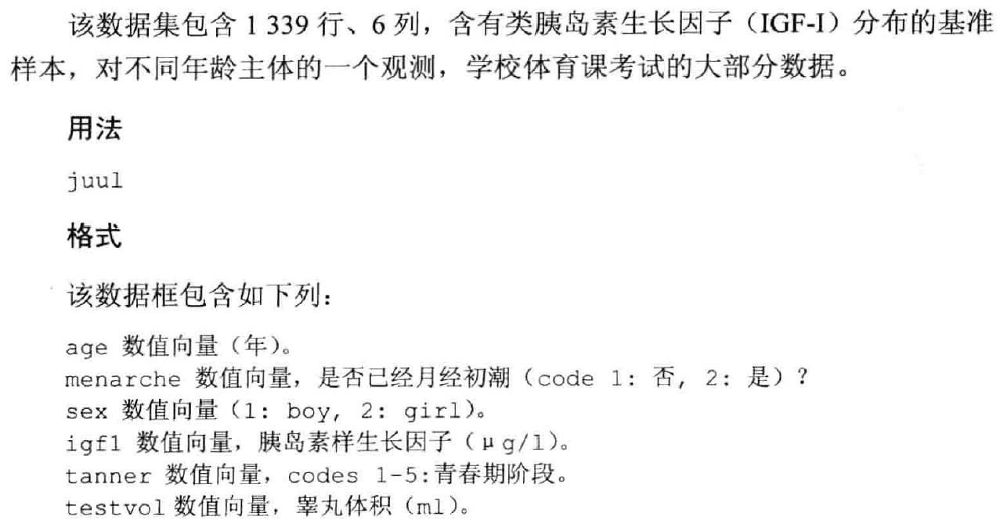
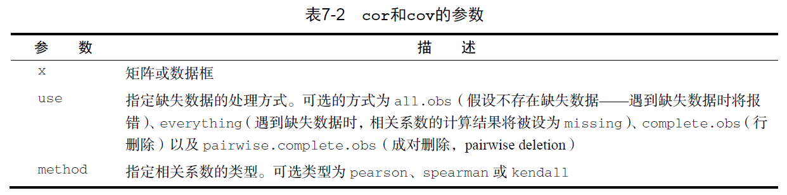

# **统计描述与基础统计分析方法**

## 描述性统计分析

### 单组数据汇总统计量

➢ 均数、标准差、中位数、分位数计算

➢ 统计描述过程中的缺失值处理

➢ ISwR包中的 juul 数据集

```{r,echo=FALSE}

```

```{r}
library(ISwR)
attach(juul)
mean(igf1)
mean(igf1,na.rm=T)
sum(!is.na(igf1))
summary(igf1)
summary(juul)
detach(juul)
```

```{r }
#将某些数值因子化，避免对描述性变量进行计算

library(ISwR)
attach(juul)
juul$sex <- factor(juul$sex,labels=c("M","F"))
juul$menarche <- factor(juul$menarche,labels=c("No","Yes"))
juul$tanner <- factor(juul$tanner,
                      labels=c("I","II","III","IV","V"))

summary(juul)
detach(juul)
```

```{r}
#以下代码与上述5行代码等价
juul <- transform(juul,
                  sex=factor(sex,labels=c("M","F")),
                  menarche=factor(menarche,labels=c("No","Yes")),
                  tanner=factor(tanner,labels=c("I","II","III","IV","V")))
attach(juul)
summary(juul)
detach(juul)
```

### 数据分布类型的图形描述

```{r}
library(ISwR)
#条形图
x <- rnorm(50)
hist(x)
#QQ图
qqnorm(x)
#箱式图
par(mfrow=c(1,2))
boxplot(IgM)
boxplot(log(IgM))
par(mfrow=c(1,1))
```

## **线性相关与秩相关分析**

### 三种相关系数

➢ Pearson相关系数

➢ Spearman秩相关

➢ Kendall相关系数

➢ `cor()`函数可以计算这三种相关系数，而`cov()`函数可用来计算协方差。两个函数的参数有很多，其中与相关系数的计算有关的参数可以简化为：`cor(x, use= , method= )`
```{r,echo=FALSE}

```

### 相关系数的显著性检验

➢ 可以使用`cor.test()`函数对单个的Pearson、Spearman和Kendall相关系数进行
检验。简化后的使用格式为：`cor.test(x, y, alternative = , method = )`

➢ 其中的`x`和`y`为要检验相关性的变量，`alternative`则用来指定进行双侧检验或单侧
检验（取值为`"two.side"`、`"less"`或`"greater"`），而`method`用以指定要计算的
相关类型（`"pearson"`、`"kendall"` 或`"spearman"` ）。当研究的假设为总体的相
关系数小于0 时， 请使用`alternative="less"` 。在研究的假设为总体的相关系数
大于0 时， 应使用`alternative="greater"`。在默认情况下，假设为
`alternative="two.side"`（总体相关系数不等于0）。

## **组间差异t检验**


在研究中最常见的行为就是对两个组进行比较。接受某种新药治疗的患者是否较使用某种现有药物的患者表现出了更大程度的改善？这里我们将关注结果变 为连续型的组间比较，并假设其服从正态分布。

### 单样本t检验

【案例】输入一组变量，对它进行统计分析

```{r}
daily.intake <- c(5260,5470,5640,6180,6390,6515,
                  6805,7515,7515,8230,8770)
mean(daily.intake)
sd(daily.intake)
quantile(daily.intake)
```

进行单样本t检验及秩和检验

```{r}
t.test(daily.intake,mu=7725)

wilcox.test(daily.intake, mu=7725)
```


实际上，在现实研究过程中，我们并不在意单样本的t检验是否有意义。

### 两样本t检验

一个针对两组的独立样本t检验可以用于检验两个总体的均值相等的假设。这里假设两组数据是独立的，并且是从正态总体中抽得。检验的调用格式为：
`t.test(y~x , data)`。

可选参数`data`的取值为一个包含了这些变量的矩阵或数据框。与其他多数统计软件不同的是，这里的t检验默认假定方差不相等，并使用Welsh的修正自由度你可以添加一个参数
`var.equl=TRUE `以假定方差相等，并使用合并方差估计。默认的备择假设是双侧的（即均值不相等，但大小的方向不确定） 
你可以添加一个参数
`alternative="less"`或`alternative="greater"`来进行有方向的检验

\

代码清单
```{r,message=FALSE}
library(ISwR)
attach(energy)
energy

# 两样本t检验
t.test(expend~stature)

#假定方差齐
t.test(expend~stature, var.equal=T)
#方差齐性检验
var.test(expend~stature)
#符号秩和检验
wilcox.test(expend~stature)
```


## 组间差异秩和检验

如果数据无法满足 检验或ANOVA的参数假设，可以转而使用非参数方法。举例来说，若结果变量在木质上就严重偏倚或呈现有序关系，那么你可能会希望使用本节中的方法。


### 单样本Wilcoxon符号秩检验

`wilcox.test(x, mu= )`
    
x为检验样本;mu为总体均数

```{r}
daily.intake <- c(5260,5470,5640,6180,6390,6515,
                  6805,7515,7515,8230,8770)
mean(daily.intake)
sd(daily.intake)
quantile(daily.intake)

t.test(daily.intake,mu=7725)

wilcox.test(daily.intake, mu=7725)
```


### 两组的比较

若两组数据独立，可以使用Wilcoxon秩和检验（更广为人知的名字是Mann-Whitney 检验）来评估观测是否是从相同的概率分布中抽得的（即，在一个总体中获得更高得分的概率是否比另一个总体要大）。调用格式为

`wilcox.test(x~y,data)`

"x"  ——结果变量

"y"  ——分组变量

```{r}
library(ISwR)
attach(energy)
energy
t.test(expend~stature)

t.test(expend~stature, var.equal=T)

var.test(expend~stature)

wilcox.test(expend~stature)
```


### 配对Wilcoxon符号秩检验

`wilcox.test(x, y, paired=T)`
    
x，y 为配对的两组变量
    
`paired=T` 意为该变量为配对变量，否则系统将认为这两组变量无关，按照两独立样本t检验执行


```{r}
attach(intake)
intake
post - pre
t.test(pre, post, paired=T)

# t.test(pre, post) #WRONG!

wilcox.test(pre, post, paired=T)
```


