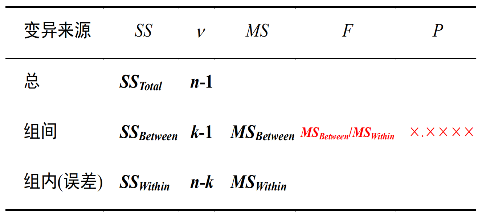
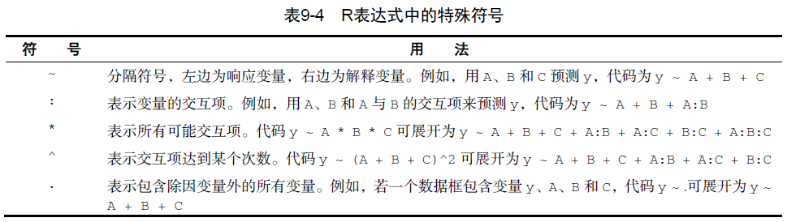
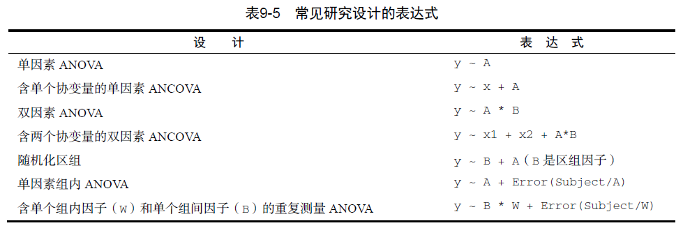

# **方差分析与秩和Kruskal-Wallis检验**

## 方差分析概述

### 方差分析基本思想

```{r,echo=FALSE}

```

$$
总变异=组间变异＋组内变异
$$


```{r,echo=FALSE}
knitr::include_graphics("fig/42.png")
```

### 方差分析用途

1.检验两个或多个样本均数间的差异有无统计学意义

- 两个样本均数的比较可以采用t检验或者F检验

- 两个以上样本均数的比较只能用F检验


2.回归方程的线性假设检验

3.检验两个或多个因素间有无交互作用

### 方差分应用条件

1.各个样本是相互独立的随机样本

2.各个样本来自正态总体

3.各个处理组的方差相等，即方差齐

4.不满足方差分析应用条件的处理

- 进行变量变换，以达到方差齐或正态的要求
    
- 采用非参数法（秩和检验）
    
- 使用近似F检验


### 方差分析的R语言实现

➢ ANOVA和回归方法都是独立发展，但从函数形式上，它们都是广义线性模型的特例。回归中的`lm()`函数也能分析ANOVA模型。两个函数的结果是等同的。

➢ `aov()`函数的语法为：
`aov(formula, data=dataframe)`

表9-4列举了表达式中可以使用的特殊符号。表9-4中的y是因变量，字母A、B、C代表因子。

```{r,echo=FALSE}

```

表9-5列举了一些常见的研究设计表达式。在表9-5中，小写字母表示定量变量，
大写字母表示组别因子，Subject是对被试者独有的标识变量


```{r,echo=FALSE}

```

### 表达式中各项的顺序

表达式中效应的顺序在两种情况下会造成影响：

(a)因子不止一个，并且是非平衡设计；

(b)存在协变量。出现任意一种情况时，等式右边的变量都与其他每个变量相关。此时，我们无法清晰地划分它们对因变量的影响。例如，对于双因素方差分析，若不同处理方式中的观测数不同，那么模型`y ~ A*B`与模型`y ~ B*A`的结果不同

样本大小越不平衡，效应项的顺序对结果的影响越大。一般来说，越基础性的效应越需要放在表达式前面。具体来讲，首先是协变量，然后是主效应，接着是双因素的交互项，再接着是三因素的交互项，以此类推。对于主效应，越基础性的变量越应放在表达式前面，因此性别要放在处理方式之前。有一个基本的准则：若研究设计不是正交的（也就是说，因子和/或协变量相关），一定要谨慎设置效应的顺序。
\

**顺序很重要！**

含因子A、B和因变量y的双因素不平衡因子设计，有三种效应：A和B的主效应，A 和B的交互效应。假设你正使用如下表达式对数据进行建模：`Y ~ A + B + A:B` 

有三种类型的方法可以分解等式右边各效应对y所解释的方差。

➢ 类型Ⅰ（序贯型）效应根据表达式中先出现的效应做调整。A不做调整，B根据A调整，A:B交互项根据A和B调整。

➢ 类型Ⅱ（分层型）效应根据同水平或低水平的效应做调整。A根据B调整，B依据A调整，A:B交互项同时根据A和B调整。

➢ 类型Ⅲ（边界型）每个效应根据模型其他各效应做相应调整。A根据B和A:B做调整，A:B交互项根据A和B调整。

R默认调用类型I方法，其他软件（比如SAS和SPSS）默认调用类型Ⅲ方法。


➢请注意`car`包中的`Anova()`函数（不要与标准`anova()`函数混淆）提供了使用类型Ⅱ或类型Ⅲ方法的选项，而`aov()`函数使用的是类型I方法。若想使结果与其他软件（如SAS和SPSS）提供的结果保持一致，可以使用`Anova()`函数，细节可参考
`help(Anova,package="car")`。


## 单因素方差分析

➢ 单因素方差分析用于比较分类因子定义的两个或多个组别中的因变量均值。
以`multcomp `包中的 `cholesterol` 数据集为例，50个患者均接受降低胆固醇药物治疗（trt）五种疗法中的一种疗法。其中三种治疗条件使用药物相同，分别是20mg一天一次（1time）、10mg一天两次（2times）和5mg一天四次（4times）。剩下的两种方式（drugD和drugE）代表候选药物。哪种药物疗法降低胆固醇（响应变量）最多呢？分析过程见如下代码。

```{r,message=FALSE}
library(multcomp)
attach(cholesterol)
table(trt)     #①
aggregate(response, by=list(trt), FUN=mean) #②
aggregate(response, by=list(trt), FUN=sd) #③
fit <- aov(response ~ trt)    #④                              
summary(fit)
```

***结果解读***

- 从输出结果可以看到，每 10个患者接受其中一个药物疗法①

- 均值显示drugE降低胆固醇最多，而1time 降低胆固醇最少②

- 各组的标准差相对恒定，在2.88~3.48间浮动③

- ANOVA对治疗方式 (trt)的 检验非常显著 (p<0.0001),说明五种疗法的效果不同④  


`gplot`包中的`plotmeans()`可以用来绘制带有置信区间的组均值图形 如图所示，图形展示了带有95%的置信区间的各疗法均值，可以清楚看到它们之间的差异。

```{r,message=FALSE}
library(gplots)
plotmeans(response ~ trt, xlab="Treatment", ylab="Response", 
          main="Mean Plot\nwith 95% CI")
detach(cholesterol)
```


### 多重比较

➢ 虽然ANOVA对各疗法的F检验表明五种药物疗法效果不同，但是并没有告诉你哪
种疗法与其他疗法不同。多重比较可以解决这个问题。例如，`TukeyHSD()`函数
提供了对各组均值差异的成对检验（见如下代码）。

```{r,message=FALSE}
par(ask=TRUE)
opar <- par(no.readonly=TRUE) # save original parameters

TukeyHSD(fit)
par(las=2)
par(mar=c(5,8,4,2)) 
plot(TukeyHSD(fit))
par(opar)
```


```{r,message=FALSE}
# Multiple comparisons the multcomp package
library(multcomp)
par(mar=c(5,4,6,2))
tuk <- glht(fit, linfct=mcp(trt="Tukey"))
plot(cld(tuk, level=.05),col="lightgrey")
par(opar)
```


***结果解读***

- 可以看到，1time和2times 的均值差异不显著 (p=0.138), 1time和4times间的差异非常显著(p<0.001)。

- 成对比较图形如图所示。第一个`par`语句用来旋转轴标签，第二个用来增大左边界的面积，可使标签摆放更美观。 图形中置信区间包含0的疗法说明差异不显著(p>0.5)。


### 评估方差分析的假设条件

➢ 单因素方差分析中，我们假设因变量服从正态分布，各组方差相等。可使用Q-Q
图来检验正态性假设：

```{r,message=FALSE}
library(car)
qqPlot(lm(response ~ trt, data=cholesterol), 
       simulate=TRUE, main="Q-Q Plot", labels=FALSE)
```

➢ R提供了一些可用来做方差齐性检验的函数。例如，可以通过如下代码来做
bartlett检验：


```{r}
bartlett.test(response ~ trt, data=cholesterol)
```

➢ 方差齐性分析对离群点非常敏感。可利用car包中的`outlierTest()`函数来检测离群点：
```{r,message=FALSE}
library(car)
outlierTest(fit)
```


## 双因素方差分析

➢ 双因素方差分析中，受试者被分配到两因子交叉类别组中。以基础安装包的
`ToothGrowth` 数据集为例，随机分配60只豚鼠，分别采用两种喂食方法（橙汁或维生素C），各喂食方法中抗坏血酸含量有三种水平（0.5mg、1mg或2mg），每种处理方式组合都被分配10只豚鼠。牙齿长度为因变量，代码如下
```{r}
attach(ToothGrowth)
table(supp,dose)
aggregate(len, by=list(supp,dose), FUN=mean)
aggregate(len, by=list(supp,dose), FUN=sd)
dose <- factor(dose)
fit <- aov(len ~ supp*dose) # fit1<- aov(len~supp+dose+supp:dose)
summary(fit)
```

table语句的预处理表明该设计是均衡设计（各设计单元中样本大小都相同），
`aggregate`语句处理可获得各单元的均值和标准差。`dose`变量被转换为因子变量，这样`aov()`函数就会将它当做一个分组变量，而不是一个数值型协变量。用`summary()`函数得到方差分析表，可以看到主效应（supp和dose）和交互效应都非常显著。

\

有多种方式对结果进行可视化处理。此处可用`interaction.plot()`函数来展示双因素方差分析的交互效应。

```{r}
interaction.plot(dose, supp, len, type="b", 
                 col=c("red","blue"), pch=c(16, 18),
                 main = "Interaction between Dose and Supplement
                 Type")
```


还可以用`gplots`包中的`plotmeans()`函数来展示交互效应，代码如下：

```{r}
library(gplots)
plotmeans(len ~ interaction(supp, dose, sep=" "),
          connect=list(c(1, 3, 5),c(2, 4, 6)), 
          col=c("red","darkgreen"),
          main = "Interaction Plot with 95% CIs", 
          xlab="Treatment and Dose Combination")
```


图形展示了均值、误差棒（95%的置信区间）和样本大小。
\

最后，你还能用HH包中的函数来可视化结果，图形对任意顺序的因子设计的主效应和交互效应都会进行展示


```{r}
library(HH)
interaction2wt(len~supp*dose)
```


## 重复测量的方差分析

### 概述

一般来说，研究设计中考虑以下问题时应采用重复测量设计：

➢ 研究主要目的之一是考察某指标在不同时间的变化情况。

➢ 研究个体间变异很大，应用普通研究设计的方差分析时，方差分析表中的误差项值将很大，即计算F值时的分母很大，对反应变量有作用的因素常难以识别。

➢ 有的研究中研究对象很难征募到足够多的数量，此时可考虑对所征募到的对象在不同条件下的反应进行测量。


### 原理

➢ 基本思想：仍然应用方差分析的基本思想，将反应变量的变异分解成以下四个部分：研究对象内的变异（即测量时间点或测量条件下的效应）、研究对象间的变异（即处理因素效应）、上述两者的交互作用、随机误差变异。 

➢ 因素：

受试者内因素----用于区分重复测量次数的变量

受试者间因素----在重复测量时保持恒定的因素

➢ 分析目的：一是分析受试者间因素的作用；二是考察随着测量次数的增加，测量指标是如何发生变化的，以及分组因素的作用是否会随时间发生，即是否和时间存在交互作用

### 应用条件

➢ 反应变量之间存在相关关系。

➢ 反应变量的均数向量服从多元正态分布。

➢ 对于自变量的各取值水平组合而言，反应变量的方差、协方差矩阵相等。

### 案例1

因变量是二氧化碳吸收量（uptake），单位为ml/L，自变量是植物类型Type（魁北克VS.密西西比）和七种水平（95~1000 umol/m^2 sec）的二氧化碳浓度（conc）。另外，Type是组间因子，conc是组内因子。Type已经被存储为一个因子变量，但你还需要先将conc转换为因子变量。

```{r}
CO2$conc <- factor(CO2$conc)
w1b1 <- subset(CO2, Treatment=='chilled')
fit <- aov(uptake ~ (conc*Type) + Error(Plant/(conc)), w1b1)
summary(fit)
```


方差分析表表明在0.01 的水平下，主效应类型和浓度以及交叉效应类型 浓度都非常显著

```{r}
par(las=2)
par(mar=c(10,4,4,2))
with(w1b1, 
     interaction.plot(conc,Type,uptake, 
                      type="b", col=c("red","blue"), pch=c(16,18),
                      main="Interaction Plot for Plant Type and Concentration"))
boxplot(uptake ~ Type*conc, data=w1b1, col=(c("gold","green")),
        main="Chilled Quebec and Mississippi Plants", 
        ylab="Carbon dioxide uptake rate (umol/m^2 sec)")
par(opar)
```


通过`interaction.plot()`函数展示了交互效应,使用`boxplot()`函数对相同的数据画图。从以上任意一幅图都可以看出，魁北克省的植物比密西西比州的植物二氧化碳吸收率高，而且随着co浓度的升高，差异越来越明显。

\


## 注意

通常处理的数据集是宽格式(wide format)；即列是变量，行是观测值,
`litter`数据框就是一个很好的例子。不过在处理重复测量设计时，需要有长格式 (long format) 数据才能拟合模型。在长格式中，因变量的每次测量都要放到
它独有的行中，CO2数据集即该种形式 幸运的是，`reshape` 包可方便地将数据转换为相应的格式。


