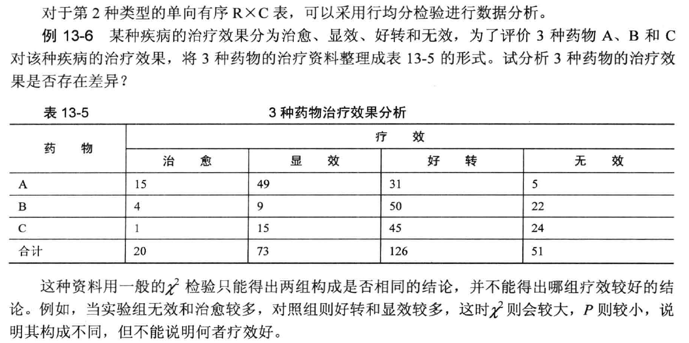

---
output:
  pdf_document: default
  html_document: default
---

# **列联表资料的处理**

## R×C表分类
1. 双向无序R X C 表， 表中两个分类变量皆为无序分类变量

①若研究目的为多个样本率(或构成比) 比较，可用行×列表资料的 $\chi ^2$ 检验
②若研究目的为分析两个分类变量之间有无关联性以及关系的密切程度，可以用行×列表资料的$\chi^2$检验，以及Pearson 列联系数分析

2. 单向有序R X C 表有两种形式

①RXC 表中的**分组变量是有序的**，而**结局变量是无序**的，此种单向有序RXC 表资料可以用行×列表资料的$\chi^2$检验进行分析
②RXC 表中的**分组变量是无序**的，而**结局变量是有序**的，此种单向有序RXC表资料直用秩和检验分析

3. 双向有序属性相同R X C表，表中的两个分类变量皆为有序且属性相同。实际上是2 X 2配对设计的扩展，此时宜用一致性检验(或称Kappa 检验)。

4. 双向有序属性不同R X C 表，表中两个分类变量皆为有序且属性不同。对于该类资料，需要分析两个有序分类变量间是否存在线性变化趋势， 可用有序分组资料线性趋势检验。

## 列变量为有序变量的行均分检验（Cochran-Mantel-Haenszel）
```{r,echo=FALSE}

```

### 行均分检验Cochran-Mantel-Haenszel
```{r}
# 行均分检验 Cochran-Mantel-Haenszel
Example13_7  <- read.table ("data/example13_7.csv", header=TRUE, sep=",")
attach(Example13_7)
mytable  <-  xtabs(~a + b)
library(gmodels)
CrossTable(a, b)
library(vcdExtra)
CMHtest(mytable)     
detach (Example13_7)
```


***结果解读 1***

●阅读结果时，阅读第二行的结果

```
              AltHypothesis  Chisq Df       Prob
rmeans  Row mean scores differ 58.678  2 1.8125e-13
```
**此处卡方值是58.678，P＜0.0001**

### Ordinal logistic回归模型
```{r}
# 用Ordinal logistic回归模型
Example13_7  <- read.table ("data/example13_7.csv", header=TRUE, sep=",")
attach(Example13_7)
# 以下三行为设置哑变量
Example13_7$x1  <- ifelse (a==1, 1, 0)
Example13_7$x2  <- ifelse (a==2, 1, 0)
Example13_7$x3  <- ifelse (a==3, 1, 0)
library(rms)
# 拟合等级回归模型，此处实际上是以C(x3=1)为参照
fit1 <- lrm(b~ x1 + x2 ,  data=Example13_7, model=FALSE, x=FALSE, y=FALSE)
fit1
# 将fit1的回归系数单列出来
coefficients(fit1)
# 将回归系数取对数，得到OR值
exp(coefficients(fit1))
detach (Example13_7)
```

说明：
哑变量设置后，a列实际上由X1、X2、X3三列表示，a列中1变为(1,0,0)，2变为(0.1.0),3变为(0,0,1)

***结果判读 2***
(1) y=2，y=3, y=4实际上是以y=1作为参照

(2) 主要解读x1 & x2等自变量的结果

(3) 计算OR值，对于累积比数因变量模型，平行性假设决定了每个自变量的OR值对于前g-1 个模型是相同的。例如，自变量xl 的OR=8.044 ，表示使用A 药物治愈的可能性是C药物的8.044 倍;也表示使用A 药物显效或治愈的可能性是C药的8.044倍;同时也表示使用A 药物至少好转的可能性是C药的8.044 倍。

## 行列变量均为有序变量检验方法
**双向有序属性不同R X C表**

例13-8 为了研究晶状体混浊程度是否与年龄相关，将资料整理为表13 -6 的形式，试编写R程序，分析年龄与晶状体混浊程度的相关关系。
```{r,echo=FALSE}

```

### sperman秩相关
```{r}
Example13_8  <- read.table ("data/example13_8.csv", header=TRUE, sep=",")
attach(Example13_8)
cor(Example13_8, method="spearman") #计算秩相关系数
cor.test(a,  b, method="spearman") # 检验秩相关系数有无意义
detach (Example13_8)
```

***结果解读***

查看相关系数以及P值

### 线性趋势检验
```{r}
# 双向有序属性不同 线性趋势检验
Example13_8  <- read.table ("data/example13_8.csv", header=TRUE, sep=",")
attach(Example13_8)
library(gmodels)
CrossTable(a, b)
mytable <-  xtabs(~a + b)
chisq.test(mytable)
fit <- lm(a~b)
summary(fit)
coefficients(fit)
confint(fit)
detach (Example13_8)
```

双向有序属性相同R X C表——一致性检验
例13-11 某学校学生的文化课成绩和体育课成绩整理如表13-7 所示，试对学生文化课和体育课成绩进行一致性检验。
```{r,echo=FALSE}
knitr::include_graphics("fig/5c.png")
```

### 一致性检验
```{r}
# 一致性检验
Example13_10  <- read.table ("data/example13_10.csv", header=TRUE, sep=",")
attach(Example13_10)
library(gmodels)
CrossTable(a, b)
mytable  <-  xtabs(~a + b)
mcnemar.test(mytable)
library(fmsb)
Kappa.test(mytable, conf.level=0.95)
detach (Example13_10)
```

## 分层行列表分析 Mantel-Haenszel 检验
例13-12 为研究心肌梗塞与近期使用避孕药之间的关系，在5所医院中采用病例-对照研究方法调查了234名心肌梗塞病人与1742 名对照者使用口服避孕药状况，资料见表13-8 。请在排除了研究医院影响后，分析使用口服避孕药与否对是否患心肌梗塞病的影响情况。
```{r}
knitr::include_graphics("fig/5d.png")
```

### Mantel-Haenszel 检验
```{r}
# Mantel-Haenszel 检验
Example13_12  <- read.table ("data/example13_12.csv", header=TRUE, sep=",")
attach(Example13_12)
mytable  <-  xtabs(~drug + case + hos) #分层输出各家医院四格表频数
mytable
prop.table(mytable,3) #分层输出各家医院四格表百分数
addmargins(mytable) #分层输出各家医院四格表边际频数
mantelhaen.test(mytable)
detach (Example13_12)
```

# **秩和检验处理列联表资料**

## 等级分组资料的非参数检验

例14- 13 用某药治疗不同病情( A 型和B 型)的老年慢性支气管炎病人， 疗效见表14-10 ，试比较该药对两种病情的疗效。
```{r,echo=FALSE}

```

```
#代码
example14_15  <- read.table ("data/example14_15.csv", header=TRUE, sep=",")
attach(example14_15)
mytable<- xtabs(~x+g)
mytable
wilcox.test(x ~ g)
detach(example14_15)
```


```
#结果
   g
x    1  2
  1 65 42
  2 18  6
  3 30 23
  4 13 11

	Wilcoxon rank sum test with continuity
	correction

data:  x by g
W = 4954.5, p-value = 0.5883
alternative hypothesis: true location shift is not equal to 0
```


## 多个组的等级指标的非参数检验
例14-14 4 种疾病患者痰液内嗜酸性粒细胞的检查结果见表14-11。试分析4 种疾病患者痰液内嗜酸性粒细胞有无差别。

```{r,echo=FALSE}

```

```
# 多个组的等级指标的非参数检验
example14_16  <- read.table ("data/example14_16.csv", header=TRUE, sep=",")
attach(example14_16)
mytable<- xtabs(~x + g)
mytable
kruskal.test(x~ g)
# 设置两两比较
library(nparcomp)
nparcomp(x ~ g, data=example14_16, alternative = "two.sided")
detach(example14_16)
```


```
   g
x   1 2 3 4
  1 0 3 5 3
  2 2 5 7 5
  3 9 5 3 3
  4 6 2 2 0

	Kruskal-Wallis rank sum test

data:  x by g
Kruskal-Wallis chi-squared = 15.506, df = 3,
p-value = 0.001432


 #------Nonparametric Multiple Comparisons for relative contrast effects-----# 
 
 ```
 
 
 
