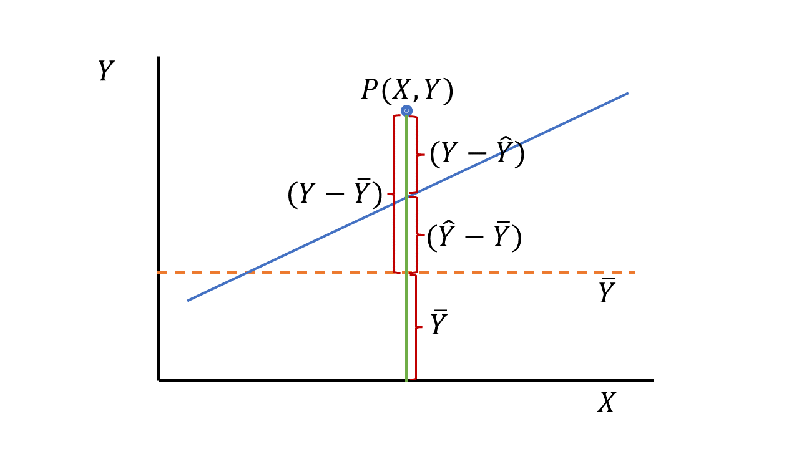
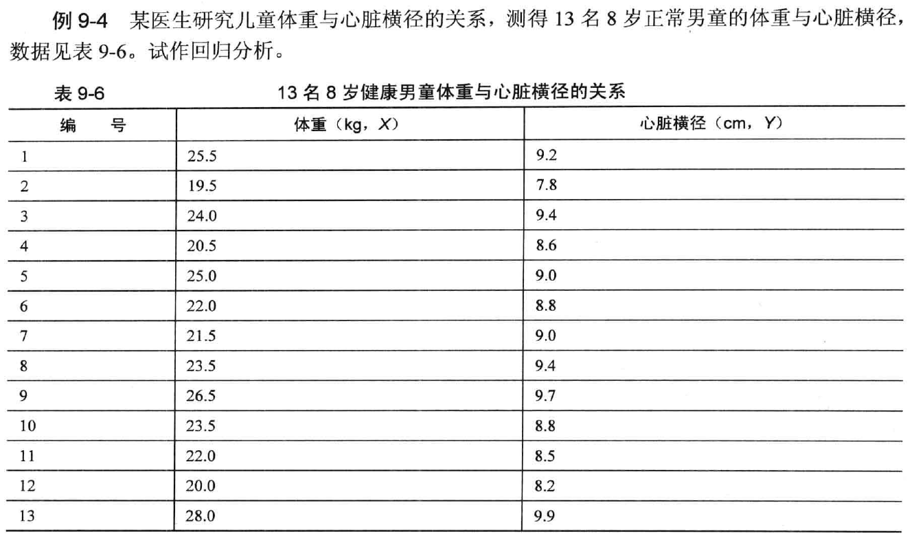
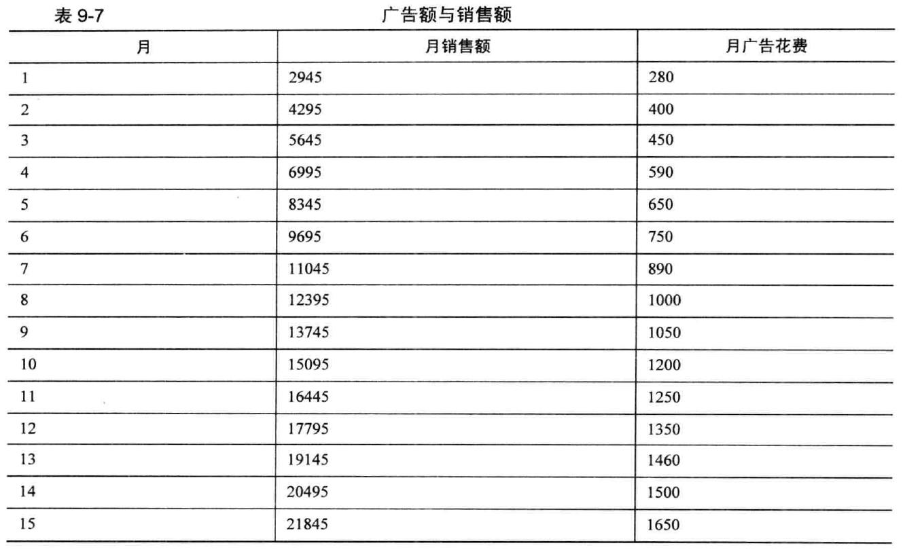
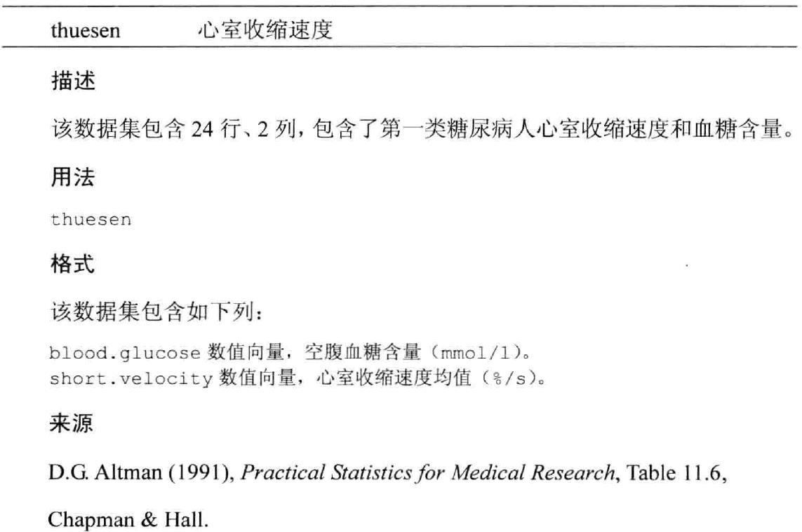

# **简单线性回归**

## 回归分析对资料的要求
➢ 回归分析涉及到两个变量，X与Y，其中X称自变量，Y 为因变量或反应变量。

- Y — 必须是呈正态分布的随机变量
- X可以是非随机变量: 年龄、药物浓度或剂量：Ⅰ型回归
- X也可以是随机变量: 身高、体重、血清胆固醇的含量，血红蛋白的含量：Ⅱ型回归

## 直线回归方程

由X推算Y的直线回归方程一般表达式为 $\widehat{Y}=a+bX$
a称为截距，b为回归系数，即直线的斜率

### 直线回归方程的建立
$$
b=\cfrac{\sum(X-\overline{X})(Y-\overline{Y})}{\sum(X-\overline{X})^2}=\cfrac{lxy}{lxx}
$$
\


$$
a= \bar Y - b \bar X
$$

式中$\overline {X}$、$\overline {Y}$分别是X、Y的均数；$l_{xx}$为X的离均差平方和；$l_{xy}$为X与Y的离均差积和，按下式计算

$l_{xy}=\sum(X-\overline{X})(Y-\overline{Y})=\sum XY-\cfrac{(\sum X)(\sum Y)}{n}$

## 回归系数b的统计学意义
➢ b>0时,Y随X增大而增大;

➢ b<0时,Y随X的增大而减少；

➢ b=0时,X与Y无直线关系。

➢ b的统计学意义是：*X每增（减）一个单位，Y平均改变 b个单位。*

## 回归分析的步骤
➢ 用原始数据绘制散点图；

➢ 求a和b (如果呈直线关系) 

➢ 对回归系数b作假设检验（方法：a. F检验 b. t检验 c. 用r检验来代替）。

➢ 如果x与y存在直线关系（ b假设检验的结果P<0.05），列出回归方程。否则，不列回归方程。

## Y的离均差平方和的划分

```{r, echo=FALSE}

```

➢ 第一段：$(Y-\widehat{Y})$表示P点与回归直线的纵向距离, 即实测值Y与估计值$\widehat{Y}$之差, 称剩余或残差。

➢ 第二段：$(Y-\widehat{Y})$ 即估计值与均数之差，它与回归系数的大小有关。|b|值越大，
$(Y-\widehat{Y})$
的差值也越大，反之越小。当b=0时，则
$(Y-\widehat{Y})=0$
。则
$(Y-\widehat{Y})=(Y-\overline{Y})$
也就是回归直线并不能使残差减小。

➢ 第三段：
$\overline{Y}$
，是应变量Y的均数

$\sum (Y-\widehat{Y})^2 = \sum(\widehat{Y}-\overline{Y})^2+\sum(Y-\widehat{Y})^2$

### 三种平方和的关系

$\sum(Y-\overline{Y})^2$
为总平方和，用$SS_总$表示

$\sum(Y-\widehat{Y})^2$
为回归平方和，用$SS_回$表示

$\sum(\widehat{Y}-\overline{Y})^2$为剩余平方和，用$SS_剩$表示

$SS_总=SS_回+SS_剩$

## 三种平方和的意义
 （1）SS总，为Y值的离均差平方和，说明未考虑X与Y的回归关系时Y总的变异。 

 （2）SS回，它反映在Y的变异中由于X与Y的直线关系而使Y变异减少的部分，也是在总平方和中可以用X解析的部分。SS回越大，说明回归效果越好。

 （3）SS剩，反映X对Y的线性影响之外其它因素对Y的变异的作用，也是在总平方和中无法用X解析的部分。SS剩越小，说明回归方程的估计误差越小。
 
### 三种平方和的自由度及其关系
$v_总=n-1，v_回=1，v_剩=n-2$

$v_总=v_回+v_剩$

## 应用回归分析应注意的问题

1.作回归分析要有实际意义

2.进行直线回归分析前，应绘制散点图

☆作用：① 看散点图是否呈直线趋势；②有无异常点、高杠杆点和强影响点

3注意建立线性回归模型的基本条件：线性、独立性、正态性、方差齐性

4.直线回归方程的适用范围以求回归方程时的X的实测值范围为限；若无充分理由证明超过该范围还是直线，应避免外延。

5.两变量有线性关系，不一定是因果关系，也不一定表面两变量间确有内在联系。

## 简单线性回归的R语言实现
在R中，拟合线性模型最基本的函数就是`lm()`，格式为：`myfit <- lm(formula, data)`

◎其中，*formula*指要拟合的模型形式，*data*是一个数据框，包含了用于拟合模型的数据。结果对象（本例中是myfit）存储在一个列表中，包含了所拟合模型的大量信息。表达式（formula）形式如下：`Y ~ X1 + X2 + ... + Xk`

◎~左边为响应变量，右边为各个预测变量，预测变量之间用+符号分隔。表8-2中的符号可以用不同方式修改这一表达式

```{r, echo=FALSE}
c<-c("fig/63.png" , "fig/64.png")
knitr::include_graphics(c)
```

◎当回归模型包含一个因变量和一个自变量时，我们称为简单线性回归。当只有一个预测变量，但同时包含变量的幂（比如，$X$、$X^2$、$X^3$）时，我们称为多项式回归。当有不止一个预测变量时，则称为多元线性回归。

## 案例 1

➢ 让我们通过一个回归示例来熟悉表8-3中的函数。基础安装中的数据集women提供了15个年龄在30~39岁间女性的身高和体重信息，我们想通过身高来预测体重，获得一个等式可以帮助我们分辨出那些过重或过轻的个体。代码如下：

```{r}
fit <- lm(weight ~ height, data=women)
summary(fit)
coefficients(fit) #列出拟合模型的模型参数（截距项和斜率）
women$weight
fitted(fit)  #列出拟合模型的预测值
residuals(fit)  #列出拟合模型的残差值
plot(women$height,women$weight,
     main="Women Age 30-39", 
     xlab="Height (in inches)", 
     ylab="Weight (in pounds)")
# add the line of best fit
abline(fit)
```

***结果解读***

◎通过输出结果，可以得到预测等式：$\widehat{Weight}= -87.52+3.45×Height$

◎由于简单回归只有一个预测变量，此处F检验等同于身高回归系数的t检验

◎Intercept：截距

◎height：斜率（斜率在结果中的名称根据数据的自变量名称改变）

◎Adjusted R-squared: 决定系数（模型好、结果准确）

## 案例 2

```{r, echo=FALSE}


```


```
library(foreign)
library(stats)
Example9_4  <- read.table ("data/example9_4.csv", header=TRUE, sep=",")
attach(Example9_4)
plot(Example9_4)
fit <-lm(y~x)
anova(fit)
summary (fit)
confint(fit)
y #输出观测值
fitted (fit)  #输出预测值
residuals (fit) #输出残差
detach (Example9_4)
```


## 案例 3
例9-5 大多数公司最终会询问关于花费在广告上的费用对公司产品销售额的影响程度。由于广告需要一定的时间才能达到它的效应，同时它的效应也不是永久持续的，它的影响也许仅仅延续开头的一段时期。假设公司相信销售额与当月以及前两个月内所花的广告费有较密切的关系，假设它们之间存在线性关系，现在有某公司15 月内有关广告花费X 与销售额Y 的数据，如表9-7 所示。

```{r, echo=FALSE}


```

```{r}
Example9_5 <- read.table ("data/example9_5.csv", header=TRUE, sep=",")
attach(Example9_5)
Example9_5 #非必须步骤，此处是为了查看数据的录入形式(注1)
fit <-  lm(SALES~ADV + ADVLAG1 + ADVLAG2)
anova(fit)
summary (fit) #生成一个拟合模型的方差分析表，或者比较两个或更多拟合模型的方差分析表
SALES #输出观测值
fitted (fit) #输出预测值
residuals (fit) #输出残差
detach (Example9_5)
```

于商家认为当月的销售额与前两个月的广告投入有关，故将之前一个月和之前两个月分别列出，当做两个独立的变量处理。故而第一行和第二行数据有缺失值（因为没有之前的数据）


# 残差与回归值&预测域与置信带

```{r, echo=FALSE}


```

```{r,ISwR}
library(ISwR)
attach(thuesen)
fit<- lm(short.velocity~blood.glucose)
summary(fit)
plot(blood.glucose,short.velocity)
abline(fit)
lm.velo <- lm(short.velocity~blood.glucose)
fitted(lm.velo)
plot(blood.glucose,short.velocity) 

# lines(blood.glucose,fitted(lm.velo)) 
# wrong 因有缺失值，所以此命令报错

lines(blood.glucose[!is.na(short.velocity)],fitted(lm.velo))

# cc <- complete.cases(thuesen) 
# options(na.action=na.exclude)
# lm.velo <- lm(short.velocity~blood.glucose)
# fitted(lm.velo)
# lines(blood.glucose,fitted(lm.velo))
segments(blood.glucose,fitted(lm.velo),
         blood.glucose,short.velocity) #带有残差线段的图形
plot(fitted(lm.velo),resid(lm.velo)) # 残差与回归值的散点图
qqnorm(resid(lm.velo)) # Q-Q图
predict(lm.velo)
predict(lm.velo,int="c") # 置信区间confidence interval
predict(lm.velo,int="p") # 预测区间prediction interval.预测区间PI总是要比对应的置信区间CI大，这是因为在对单个响应与响应均值的预测中包括了更多的不确定性。
# pred.frame <- data.frame(thuesen[4:20,]) # blood.glucose 的值是随机排列的，我们不希望置信曲线上的线段杂乱无章地排列
pred.frame <- data.frame(blood.glucose= 4:20)
pp <- predict(lm.velo, int="p", newdata=pred.frame)

pc <- predict(lm.velo, int="c", newdata=pred.frame)
plot(blood.glucose,short.velocity,
     ylim=range(short.velocity, pp, na.rm=T))
pred.gluc <- pred.frame$blood.glucose
matlines(pred.gluc, pc, lty=c(1,2,2), col="black")
matlines(pred.gluc, pp, lty=c(1,3,3), col="black")
detach(thuesen)

```
