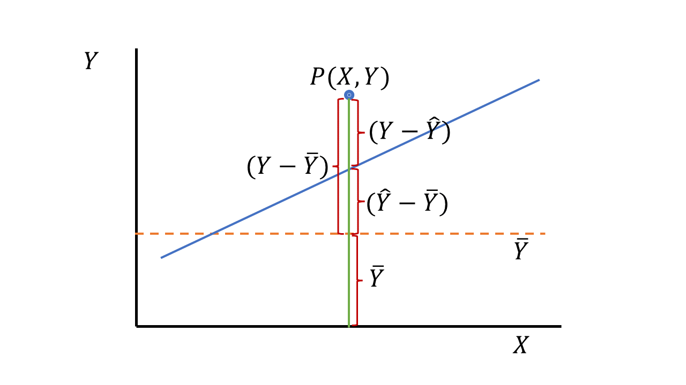

# **多元线性回归**

## 多元线性回归模型
➢ 因变量y, 自变量为x1,x2,...,xm

$$
\widehat{y}=a+b_1x_1+b_2x_2+…+b_mx_m
$$

➢ a为截距(intercept)，又称常数项(constant),表示各自变量均为0时y 的估计值

➢ bi 称为偏回归系数(partial regression coefficient)，简称为回归系数

➢ $\hat{y}$称为 y 的估计值或预测值(predicted value)

## 回归模型的应用条件


$$
y_i=\widehat{y}+e_i=b_0+b_1x_{1i}+b_2x_{2i}+ \cdots +b_mx_{mi}+e_i
$$


<font color=red>$e_i$</font> 称为残差:

- 自变量与因变量的关系是**线性**的(<font color=blue>Linear</font> )； 

- $Cov(e_i,e_j)=0$，即**独立性**(<font color=blue>Independence</font> )； 

- $e_i$~$N(0,\sigma^2)$，即**正态性**(<font color=blue>Normality</font>)； 

- $Var(e_i)=\sigma^2$，即**方差齐性**(<font color=blue>Equal variance</font>)；


## 偏回归系数的估计

- 最小二乘法 (least square, LS)

- 基本思想：残差平方和(sum of squares for residuals)最小！

### 回归方程的假设检验
```{r, echo=FALSE}


```

- 未引进回归时的总变异(sum of squares about the mean of Y):$\sum (Y-\overline Y)^2$

- 引进回归以后的剩余变异(sum of squares about regression): $\sum (Y-\widehat Y)^2$

- 回归的贡献，回归平方和(sum of squares due to regression)：$\sum (\widehat Y-\overline Y)^2$

## 案例一
例10-1 某学校20 名一年级女大学生体重(公斤)、胸围(厘米)、肩宽(厘米)及肺活量(升)实测值如表1 0-1 所示，试对影响女大学生肺活量的有关因素作多元回归分析

```{r, echo=FALSE}
knitr::include_graphics("fig/68.png")

```

```{r}
# 第三节多元线性回归案例1
Example10_1  <- read.table ("data/example10_1.csv", header=TRUE, sep=",")
library(MASS)
attach(Example10_1)
fit1  <- lm(y~ x1 + x2 + x3)
fit2 <- lm(y ~ 1)#拟合一个空模型
stepAIC(fit2,direction="both",scope=list(upper=fit1,lower=fit2))

```

***结果解读 1.1***

- Start:  AIC=-26.8; y ~ 1: 空载模型

- Step:  AIC=-39.06;y ~ x3:剔除x3后，AIC变小，说明X3应该在方程内

- Step:  AIC=-46.63;y ~ x3 + x1 + x2: 直至最后一步，AIC仍在变小，说明x1、x2、x3均应纳入回归方程。

- 若有一步剔除某个变量后，AIC值没有变化或者变大，则说明该变量应该从回归方程中剔除。

```{r}
summary (fit1)
y #观察值
fitted (fit1) #预测值
residuals (fit1) #残差
fit3<-lm(y~ x1+x2)#拟合一个不包含x3的模型
anova(fit1,fit2)#比较含有x3和不含x3模型的差别
detach (Example10_1)
```


***结果解读 1.2***    

事实证明，对于是否含有x3，对模型来说意义不大

## 案例二
例 10-2 一家皮鞋零售店将其连续18 个月的库存占用资金情况、广告投入的费用、员工薪酬以及销售额等方面的数据作了一个汇总， 如表10-2 所示。该皮鞋店老板试图根据这些数据找到销售额与其他3 个变量之间的关系，以便进行销售额预测并为未来的预算工作提供参考。根据这些数据建立回归模型

```{r, echo=FALSE}
knitr::include_graphics("fig/69.png")

```

```{r}
# 第三节多元线性回归案例2
Example10_2  <- read.table ("data/example10_2.csv", header=TRUE, sep=",")
library(MASS)
attach(Example10_2)
fit1  <- lm(Y~ X1 + X2 + X3)
fit2 <- lm(Y ~ 1)#空模型
stepAIC(fit2,direction="both",scope=list(upper=fit1,lower=fit2))
```

***结果解读 2.1***

- 在排除x3后,模型的AIC值不降反增(167.47→169.40)，故x3应从模型中剔除。

```
Step:  AIC=167.47
Y ~ X1 + X2
       Df Sum of Sq    RSS    AIC
<none>              141591 167.47
+ X3    1       500 141092 169.40
```

- `lm(formula = Y ~ X1 + X2)`：最终纳入模型的变量为x1、x2。


```{r}
fit  <- lm(Y~ X1 + X2)#拟合一个只纳入两个变量的模型
anova(fit)
summary (fit)
detach (Example10_2)
```


***结果解读 2.2***

- 在排除x3后,构建的只含有x1、x2的新模型中，x1、x2的P值均小于0.05，说明模型的x1、x2均有统计学意义

- 最终模型的R方值为0.957，说明因变量有95.7%是由回归解释的，决定系数0.951，证明剔除X3后，模型的拟合效果良好。


## 用线性回归来做ANOVA
ANOVA和回归都是广义线性模型的特例。因此，本章所有的设计都可以用 `lm()`函数来分析。但是，为了更好地理解输出结果，需要弄明白在拟合模型时，R是如何处理类别型变量的。
