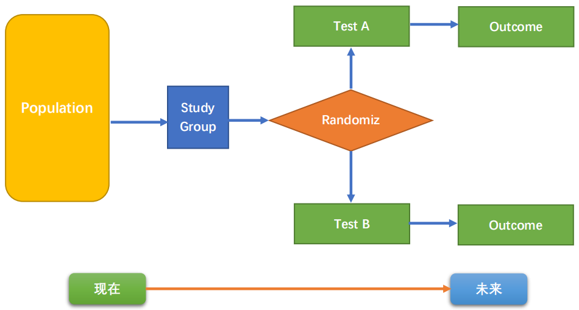
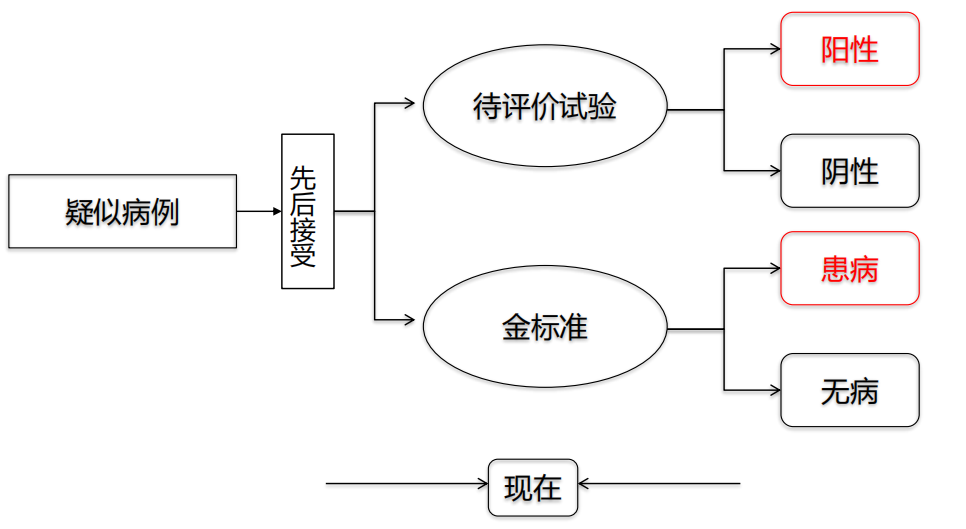
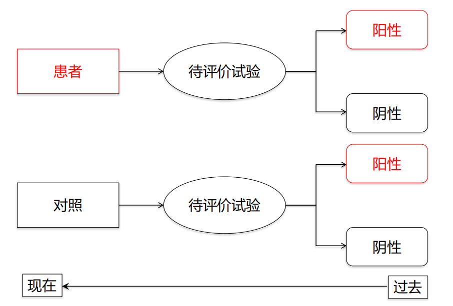
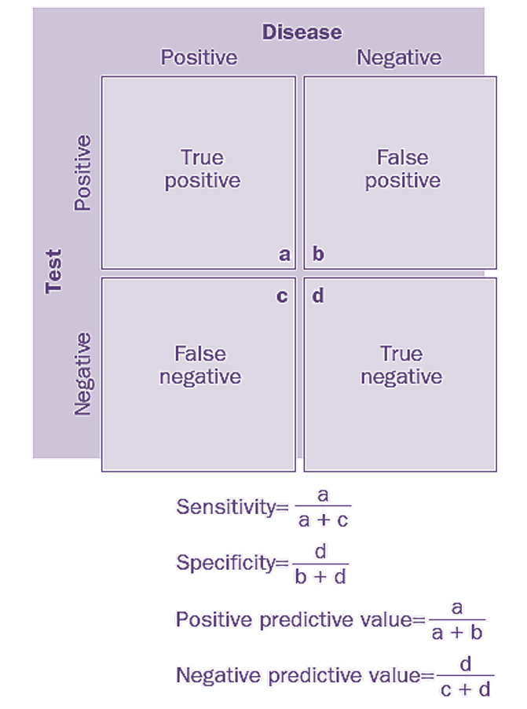
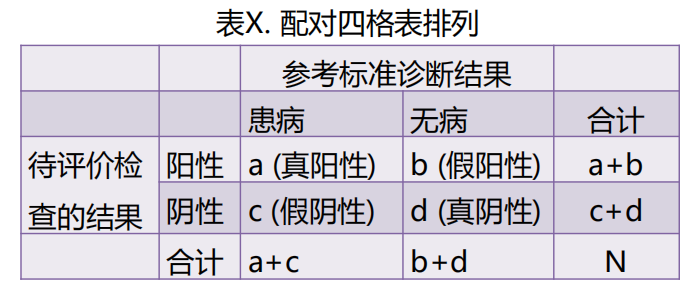
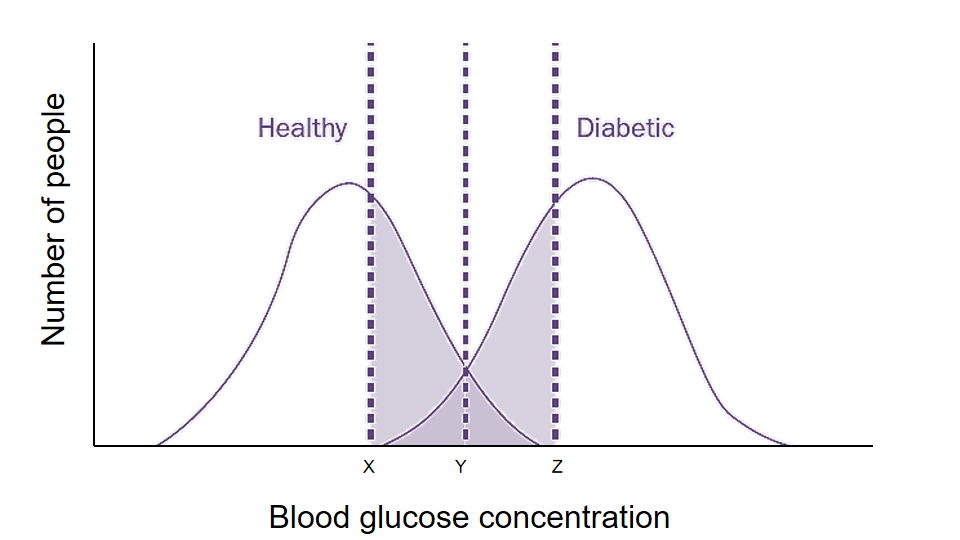
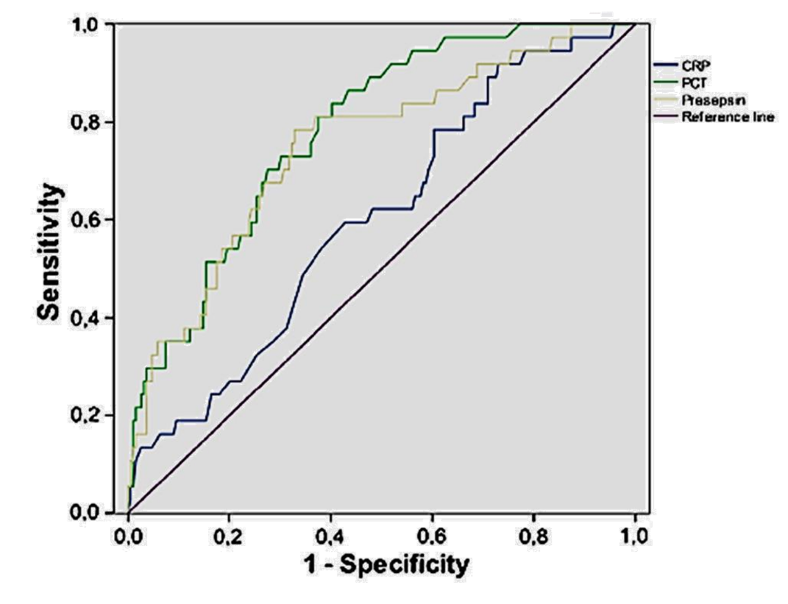
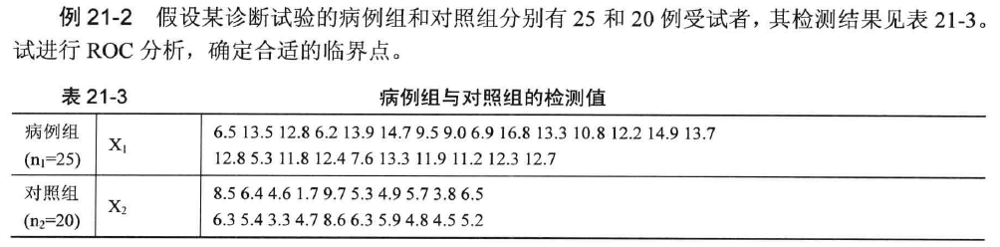
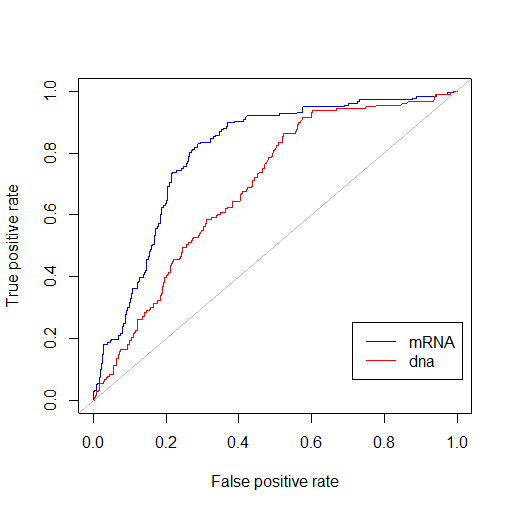

# **诊断试验的ROC分析**

## 诊断试验设计原理

### 队列研究设计

```{r,echo=FALSE}

```


### 横断面设计/单门设计


```{r,echo=FALSE}

```


### 病例对照设计/双门设计

```{r,echo=FALSE}

```


## 诊断试验的统计指标

### 基本概念

```{r,echo=FALSE}


```


$敏感性=a/(a+c)$

$特异性=d/(b+d)$

阳性预测值$PPV=a/(a+b)$

阴性预测值$NPV=d/(c+d)$

阳性似然比$PLR=\cfrac{a/(a+c)}{b/(b+d)}$ ——真阳性与假阳性之比

阴性似然比$NLR=\cfrac{d/(b+d)}{c/(a+c)}$ ——真阴性与假阴性之比

$准确率=(a+d)/(N)$


### 灵敏度和特异度之间的权衡

```{r,echo=FALSE}

```

➢ 减少漏诊必然会增加误诊

➢ 减少误诊必然会增加漏诊

➢ 提高敏感性必然降低特异性

➢ 提高特异性必然降低敏感性

【举例】AFP和DCP诊断肝癌

➢ 当AFP的诊断界值设定为15ng/ml时，诊断肝癌的敏感性为70%，特异性为80%。 

➢ 当DCP的诊断界值设定为20ng/ml时，诊断肝癌的敏感性为80%，特异性为70%。 

➢ 问题：AFP和DCP诊断肝癌的能力孰优孰劣呢？


### 受试者工作特征曲线 (ROC)


```{r,echo=FALSE}

```


➢ 曲线本质是不同界值下敏感性和特异性的组合；ROC曲线下面积(AUC) 介于0.5-1.0之间，AUC的大小反映试验诊断疾病的能力

➢ ROC反映多个诊断界点下诊断能力的总和；便于比较两个试验的诊断能力；确定最佳诊断界值。

## ROC分析的R语言实现

### 案例1

```{r,echo=FALSE}

```


```{r}
example21_2  <- read.table ("data/example21_2.csv", header=TRUE, sep=",")
attach(example21_2)
head(example21_2)
summary(example21_2)
str(example21_2) #structure of dataframe
```

我们可以看到，在使用R实现ROC分析时，需要的数据是只分成2列，用不同的数字标记方法的类型，这与SPSS中做ROC分析是完全不同的。
\ 

首先，我们构建一个逻辑回归方程
```{r}
library(ROCR)
pred <- prediction(example21_2$value, example21_2$group)
pred
```

接下来，我们用`performance()`函数来绘制一个ROC曲线

```{r}
perf <- performance(pred,"tpr","fpr")
plot(perf,col="red")
abline(a=0,b=1,col="blue")
```

下面是一些非经典的ROC曲线

```{r}
perf1 <- performance(pred, "prec", "rec")
plot(perf1)
perf2 <- performance(pred, "sens", "spec")
plot(perf2)
detach(example21_2)

```

### 案例2

例21-3 假设某研究欲比较HPV-DNA与HPV E6/E7 mRNA对中重度子宫颈上皮不典型增生的诊断价值。试进行ROC分析。

```{r,echo=FALSE}
example21_3  <- read.table ("data/example21_3.csv", header=TRUE, sep=",")
attach(example21_3)
table_1<-head(example21_3)
knitr::kable(table_1)
```

```{r}
example21_3  <- read.table ("data/example21_3.csv", header=TRUE, sep=",")
attach(example21_3)
summary(example21_3)
str(example21_3)#查看数据结构
#install.packages("ROCR")
library(ROCR)
pred1 <- prediction(example21_3$mRNA, example21_3$oncology)
pred1
pred2 <- prediction(example21_3$dna, example21_3$oncology)
pred2
perf_1 <- performance(pred1,"tpr","fpr")
perf_2 <- performance(pred2,"tpr","fpr")
auc1 <- performance(pred1,"auc")
auc1
auc2 <- performance(pred2,"auc")
auc2
```

```
plot(perf_1, col="blue")
plot(perf_2, col="red", add=TRUE)
abline(a=0,b=1,col="gray")
legend(locator(n=1),legend=c("mRNA","dna"),lty=1,col=c("blue","red"))
detach(example21_3)
```

```{r,echo=FALSE}

```

