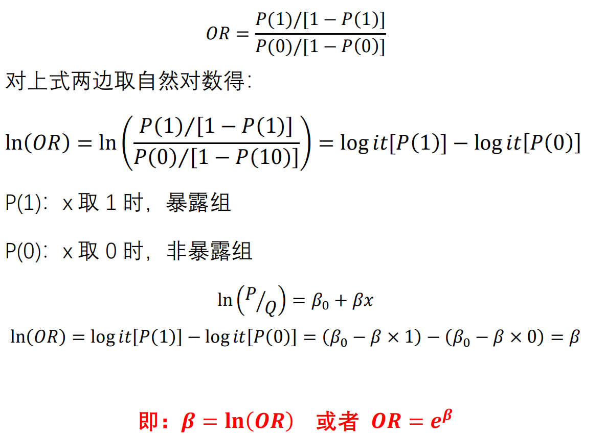
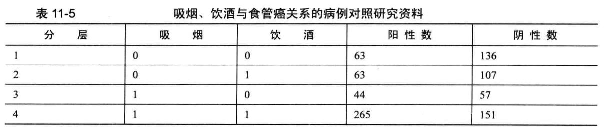
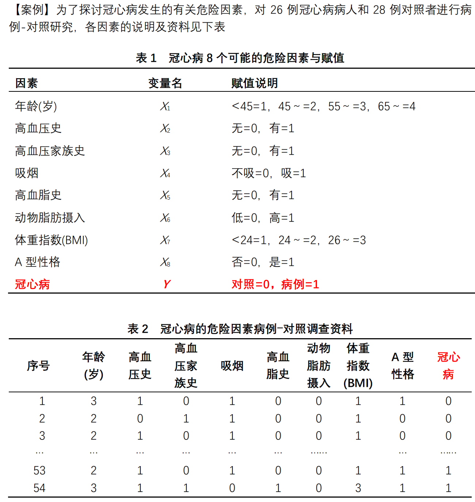
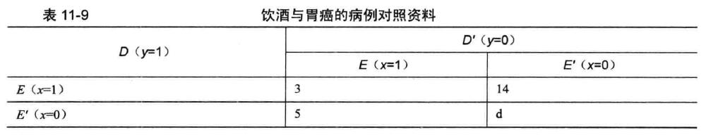

# **Logistic回归**

## 模型概述

Logistic回归模型是一种概率模型，它是以某一事件发生与否的概率P为因变量，以影响P的因素为自变量建立的回归模型，分析某事件发生的概率与自变量之间的关系，是一种非线性回归模型。

Logistic回归模型适用的资料类型：**适用于因变量为二项或多项分类（有序、无序）的资料**

Logistic回归模型分类

1. 条件Logistic 回归模型：适合于配对或配伍设计资料；

2. 非条件Logistic回归模型：适合于成组设计的统计资料

- 因变量可以是：两项分类、无序多项分类、有序多项分类等

## 模型结构
Logistic分布函数表达：$F(y)=\cfrac{e^y}{1+e^y}$

y的取值在$-\infty ~ +\infty$之间，函数值F(y)在0~1之间取值且呈单调上升的S型曲线。可以将这一特征运用到临床医学和流行病学中描述事件发生的概率与影响因素的关系

logit(P)变换:

$$
\log it(P)=\ln (\cfrac{P}{Q})
$$


$$
\log it(P)=\beta_0+\beta x
$$


$$
\log it(P)=\beta_0+\beta_1x_1+\beta_2x_2+\cdots++\beta_px_p
$$

其实变换之后就是所谓的线性回归方程，ln(P/Q)称为logit(P)变换，P/Q称为事件的优势，流行病学中称为比值（odds）
。因此，优势的对数值与影响因素之间呈线性关系


## 比值比或优势比（OR）
```{r,echo=FALSE}


```

- 暴露组的优势（比值）与非暴露组的优势（比值）之比

- OR用于说明暴露某因素引起疾病或死亡的危险度大小

- β指回归系数


## 案例1
**——结局是二分类变量最常用**

以AER包中的数据框Affairs为例，我们将通过探究婚外情的数据来阐述Logistic回归分析的过程。首次使用该数据前，请确保已下载和安装了此软件,使用`install.packages("AER")`

婚外情数据取自1969年（Psychology Today）所做一个非常有代表性的调查。该数据从601个参与者收集了9个变量，包括一年来婚外私通的频率以及参与者性别、年龄、婚龄、是否有小孩、宗教信仰程度（5分制，1分表示反对，5分表示非常信仰）、学历、职业（逆向编号的戈登7种分类），还有对婚姻自我评分（5分制，1表示非常不幸福，5表示非常幸福）。

```{r}
# get summary statistics
data(Affairs, package="AER")
summary(Affairs)
table(Affairs$affairs)

# create binary outcome variable
Affairs$ynaffair[Affairs$affairs > 0] <- 1
Affairs$ynaffair[Affairs$affairs == 0] <- 0
Affairs$ynaffair <- factor(Affairs$ynaffair, 
                           levels=c(0,1),
                           labels=c("No","Yes"))
table(Affairs$ynaffair)

# fit full model
fit.full <- glm(ynaffair ~ gender + age + yearsmarried + children + religiousness + education + occupation +rating, data=Affairs,family=binomial())
summary(fit.full)
```

***结果解读 1.1***

- 从回归系数的值（最后一栏）可以看到，性别、是否有孩子、学历和职业对方程的贡献都不显著（你无法拒绝参数为0 的假设）去除这些变量重新拟合模型，检验新模型是否拟合得好：

```{r}
# fit reduced model
fit.reduced <- glm(ynaffair ~ age + yearsmarried + religiousness + 
                     rating, data=Affairs, family=binomial())
summary(fit.reduced)
```

***结果解读 1.2***

- 新模型的每个回归系数都非常显著 (p<0.05) 由于两模型嵌套 (fit.reduced是fit.full 的一个子集)，你可以使用`anova()`函数对它们进行比较，对于广义线性回归 ，可用卡方检验

```{r}
# compare models
anova(fit.reduced, fit.full, test="Chisq")
```


***结果解读 1.3***

- 结果的卡方值不显著 (p=0.2 ),表明四个预测变量的新模型与九个完整预测变量的模型拟合程度一样好，这使得你更加坚信添加性别孩子、学历和职业变量不会显著提高方程的预测精度，因此可以依据更简单的模型进行解释

```{r}
# interpret coefficients
coef(fit.reduced)
```

***结果解读 1.4***

- 先看看回归系数：Logistic 回归中，响应变量是Y=1的对数优势比 (log) 回归系数的含义是当其他预测变量不变时．一单位预测变量的变化可引起的响应变量对数优势比的变化。

- 由于对数优势比解释性差，你可对结果进行指数化

```{r}
exp(coef(fit.reduced)) #取反对数
```
***结果解读 1.5***

- 可以看到婚龄增加一年，婚外情的优势比将乘以1.106(保持年龄、宗教信仰和婚姻评定不变)

- 相反年龄增加一岁，婚外清的的优势比则乘以0.965

- 此外，随着婚龄的增加和年龄、宗教信仰与婚姻评分的降低，婚外情优势比将上升。因为预测变量不能等于0, 截距项在此处没有什么特定含义

- 你还可使用`confint()`函数获取系数的置信区间。例如，`exp(confint(fit,reduced))`可在优势比尺度上得到系数95%的置信区间.

***结果解读 1.6***

- 预测变量一单位的变化可能并不是我们最想关注的

- 对于二值型Logistic回归，某预测变量n单位的变化引起的较高值上优势比的变化为$\exp (\beta_j)^n$，它反映的信息可能更为重要

- 比如，保持其他预测变量不变，婚龄增加一年，婚外情的优势比将乘以1.106，而如果婚龄增加10年，优势比将乘以$1.106^{10}$，即2.7。

### 评价预测变量对结果概率的影响

- 对于我们大多数人来说，以概率的方式思考比使用优势比更直观 

- 使用`predict()`函数，可以观察某个预测变量在各个水平时对结果概率的影响 

- 首先创建一个包含你感兴趣预测变量值的虚拟数据集，然后对该数据集使用`predict()`函数，以预测这些值的结果概率。

现在我们使用该方法评价婚姻评分对婚外情概率的影响 

- 首先， 建一个虚拟数据集，设定年龄、婚龄和宗教信仰为它们的均值，婚姻评分的范围为1~5

```{r}
# calculate probability of extramariatal affair by marital ratings
testdata <- data.frame(rating = c(1, 2, 3, 4, 5),
                       age = mean(Affairs$age),
                       yearsmarried = mean(Affairs$yearsmarried),
                       religiousness = mean(Affairs$religiousness))
testdata
```

- 接下来，使用测试数据集预测相应的概率

```{r}
testdata$prob <- predict(fit.reduced, newdata=testdata, type="response")
testdata
```

***结果解读 1.7***

- 从这些结果可以看到，当婚姻评分从(很不幸福)变为(非常幸福)时，婚外情概率从0.53降低到了 15 (假定年龄、婚龄和宗教信仰不变)

下面我们再看看年龄的影响

```{r}
# calculate probabilites of extramariatal affair by age
testdata <- data.frame(rating = mean(Affairs$rating),
                       age = seq(17, 57, 10), 
                       yearsmarried = mean(Affairs$yearsmarried),
                       religiousness = mean(Affairs$religiousness))
testdata$prob <- predict(fit.reduced, newdata=testdata, type="response")
testdata
```


***结果解读 1.8***

- 此处可以看到，当其他变量不变，年龄从 17 增加到57 时，婚外情的概率将从0.34降低到 0.11，利用该方法，你可探究每一个预测变量对结果概率的影响


- 在婚外情的例子中，婚外偷腥的次数被二值化为一个“是/否”的响应变量，这是因为我们最感兴趣的是在过去一年中调查对象是否有过一次婚外情。如果兴趣转移到量上（过去一年中婚外情的次数），便可直接对计数型数据进行分析。分析计数型数据的一种流行方法是**泊松回归**。


## 案例2

表11-5 是一个研究吸烟、饮酒与食管癌关系的病例-对照研究资料，试作Logistic 回归分析。设y=1 表示患有食管癌， y=0表示未患食管癌。令x1=1 表示吸烟，x1=0 表示不吸烟: x2=1表示饮酒，x2=0 表示不饮酒

```{r,echo=FALSE}


```


```{r}
# Logistic回归案例2
Example11_4  <- read.table ("data/example11_4.csv", header=TRUE, sep=",")
attach(Example11_4)

fit1 <- glm(y~ x1 + x2, family= binomial(), data=Example11_4)
summary(fit1)
coefficients(fit1)
exp(coefficients(fit1)) #计算OR值
exp (confint(fit1)) #计算95%CI
```

***结果解读 2.1***

- 吸烟的人患食管癌的概率是不吸烟的2.4243991倍，其95%CI是1.8090525~3.2580064

- 饮酒的人患食管癌的概率是不饮酒的1.6923589倍，其95%CI是1.2441606~2.3048818


### 因素间的交互作用

本例分析吸烟、饮酒危险因素对患食管癌的影响程度以及它们的交互影响程度。设y=1 表示患有食管癌， y=0 表示未患食管癌。

令x1=1 表示吸烟， x1=0 表示不吸烟: x2=1表示饮酒， X2=0 表示不饮酒。这样， x1和x2的交叉水平有4 个，建立4 个哑变量分别代表这4 个水平，记为x11、x10 、x01、x00，它们表示4 种不同的生活方式，即x11表示既吸烟又饮酒， X10表示吸烟但不饮酒， x01 表示不吸烟但饮酒， x00表示既不吸烟又不饮酒。将前3 个哑变量放进模型， 则可得到前3 种生活方式相对于最后一种生活方式患食管癌的相对危险度。
```{r}
fit2 <- glm(y~ x1 + x2 + x1:x2 ,  family= binomial(), data=Example11_4)
summary(fit2)
coefficients(fit2)
exp(coefficients(fit2))
exp (confint(fit2))
```

***结果解读 2.2***

- 由此可见，X1与X2交互项的P值为0.0647，不能很好的说明二者是否有交互，故而需要设置哑变量。

```{r}
#设置哑变量
Example11_4$x11  <- ifelse (x1==1 & x2==1, 1, 0)
Example11_4$x10  <- ifelse (x1==1 & x2==0, 1, 0)
Example11_4$x01  <- ifelse (x1==0 & x2==1, 1, 0)
Example11_4$x00  <- ifelse (x1==0 & x2==0, 1, 0)
#拟合新模型
fit3 <- glm(y~ x11 + x10 + x01, family= binomial(), data=Example11_4)
summary(fit3)
```

***结果解读 2.3***

- 结果中X11、X10和X00相比，均有统计学意义。但是X01就无统计学意义了。

```{r}
coefficients(fit3)
exp(coefficients(fit3))
exp(confint(fit3))
detach (Example11_4)
```

***结果解读 2.4***

- 结果表明：既吸烟又饮酒(x11)的人患食管癌的概率是不吸烟也不饮酒的人的3.7884999倍；吸烟不饮酒(x10)的人患食管癌的概率是不吸烟也不饮酒的人的1.6663882倍。

## 案例 3
例11-5 为了探讨冠心病发生的有关危险因素， 对26例冠心病病人和28例对照者进行病例-对照研究，各因素的说明及资料见表1和表2。试用Logistic 逐步回归分析方法筛选危险因素。

```{r,echo=FALSE}


```


```{r}
# Logistic回归案例3
Example11_5 <- read.table ("data/example11_5.csv", header=TRUE, sep=",")
attach(Example11_5)
fullfit <- glm(y~ x1 + x2 + x3 + x4 + x5 + x6 + x7 + x8 ,  family= binomial(), data=Example11_5)
summary(fullfit)
nothing <- glm(y~ 1, family= binomial(), data=Example11_5) #空模型
summary(nothing)
bothways <- step(nothing, list(lower=formula(nothing), upper=formula(fullfit)),  direction="both")
#从nothing开始，到fullfit终止
fit1 <- glm(y~ x6 + x5 + x8 + x1 + x2 ,  family= binomial(), data=Example11_5)
summary(fit1)
fit2 <- glm(y~ x6 + x5 + x8 + x1, family= binomial(), data=Example11_5)
summary(fit2)
coefficients(fit2)
exp(coefficients(fit2))
exp (confint(fit2))
detach (Example11_5)
```


## 案例4
**——条件logistic回归**

某研究机构为了研究胃癌与饮酒的相关关系，收集了病例对照资料如表1 1-9 所示，其中D和D'分别表示患有胃癌和未患有胃癌,E和E'分别表示饮酒和不饮酒。试用条件Logistic回归模型分析饮酒对胃癌的影响。


```{r,echo=FALSE}


```


```{r}
#条件Logistic回归案例 4
#install.packages("survival")
library(survival)
Example11_6  <- read.table ("data/example11_6.csv", header=TRUE, sep=",")
attach(Example11_6)
#拟合模型
model <- clogit(outcome~ exposure+ strata(id))
#  strata(id)：指定对子号
summary(model)
detach(Example11_6)
```

***结果解读 4***

- 使用survival包中的`clogit()`函数进行计算

- 在结果中可以看到，模型的回归系数coef是1.03；回归系数的标准误se(coef)是0.521；P值是0.0481。

- 故饮酒对胃癌的OR值即exp(coef)=2.8；可以理解为，饮酒的人患胃癌的概率是不饮酒的人的2.8倍。


## 扩展的Logistic回归及其变种

### 稳健Logistic回归 

- robust包中的`glmRob()`函数可用来拟合稳健的广义线性模型，包括稳健Logistic回归。当拟合Logistic回归模型数据出现离群点和强影响点时，稳健Logistic回归便可派上用场。

### 多项分布回归 

- 若响应变量包含两个以上的无序类别（比如，已婚/寡居/离婚），便可使用mlogit包中的`mlogit()`函数拟合多项Logistic回归。

### 序数Logistic回归 

- 若响应变量是一组有序的类别（比如，信用风险为差/良/好），便可使用rms包中的`lrm()`函数拟合序数Logistic回归。


