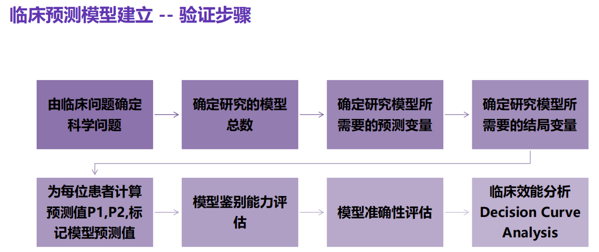
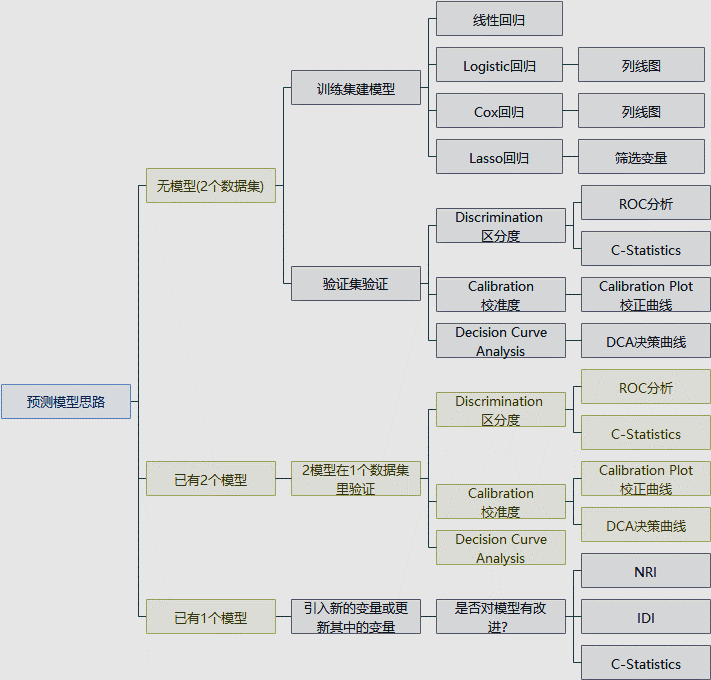
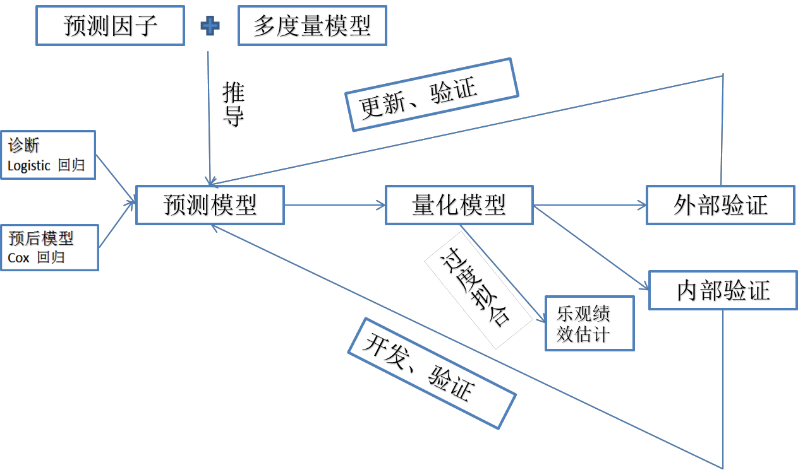

---
output:
  pdf_document: default
  html_document: default
---


#  **Logistic回归模型**

## 临床预测模型的本质

➢ 科研预测模型是通过已知来预测未知，而模型就是一个复杂的公式。也就是把已
知的东西通过这个模型的计算来预测未知的东西。

➢ 临床预测模型的本质就是通过回归建模分析，回归的本质就是发现规律。回归是
量化刻画，X多大程度上影响Y。尤其是多元线性、Logistic、Cox回归分析等。

➢ 模型的验证也体现着较高技术难度。模型效能评价是统计分析、数据建模、课题
设计的关键所在。

## 临床预测模型建立

### 验证步骤

```{r,echo=FALSE}


```

### 研究思路

```{r,echo=FALSE}


```

***【举例】***

➢ 临床上有多个心血管疾病风险预测工具：Framingham、QRISK、PROCAM、
ASSIGN评分。Heart发表综述《Graphics and Statistics for Cardiology: 
Clinical Prediction Rules》以心血管风险评分(CVD risk factor)为例探讨如何借
助图形优势构建疾病的预测模型，并提出了6个重要步骤。

1. 选择一组预测变量作为潜在CVD影响因素纳入到风险评分中

2. 选择一个合适的统计模型来分析预测变量和CVD之间的关系

3. 从已有的预测变量中，选择足够重要的变量纳入到风险评分中

4. 构造风险评分模型

5. 评价风险评分模型

6. 在临床实践中解释风险评分的使用。


### 预测类案例研究思路总结

```{r,echo=FALSE}

```


## 案例1

➢ Hosmer 和 Lemeshow于1989年研究了低出生体重婴儿的影响因素。结果变量为是否娩出低出生体重儿（变量名为LOW，1=低出生体重，即婴儿出生体重<2500g; 0=非低出生体重），考虑的影响因素（自变量）有：产妇妊娠前体重（lwt，磅）；产妇年龄（age，岁）；产妇在妊娠期间是否吸烟（smoke，0＝未吸、1＝吸烟）；本次妊娠前早产次数（ptl，次）；是否患有高血压（ht，0＝未患、1＝患病）；子宫对按摩、催产素等刺激引起收缩的应激性（ui，0＝无、1＝有）；妊娠前三个月社区医生随访次数（ftv，次）；种族（race，1＝白人、2＝黑人、3＝其他民族）。


### 变量筛选

```{r,message=FALSE}
library(foreign) #为了载入sav等形式的外部数据
library(rms)
mydata<-read.spss("data/lweight.sav")
mydata<-as.data.frame(mydata) #将数据转换为数据框结构
head(mydata)  #查看数据前6行
#设置哑变量
mydata$low <- ifelse(mydata$low =="低出生体重",1,0)
mydata$race1 <- ifelse(mydata$race =="白种人",1,0)
mydata$race2 <- ifelse(mydata$race =="黑种人",1,0)
mydata$race3 <- ifelse(mydata$race =="其他种族",1,0)
attach(mydata)
dd<-datadist(mydata) #打包数据集
options(datadist='dd')
# 拟合回归模型，不含race3是由于将其作为参照
fit1<-lrm(low~age+ftv+ht+lwt+ptl+smoke+ui+race1+race2,
          data=mydata,x=T,y=T)
fit1
#查看OR值
summary(fit1)
```

***结果解读 1.1***

- 从模型中可以筛选出有统计学意义(P＜0.05)的变量

- 结果为：ht=妊高症(P=0.0105)、lwt(P=0.0431)、smoke=吸烟(P=0.02)、race1(P=0.0375)

- 此处需要注意的是，为了设置哑变量而重新定义的变量race1在模型中是具有统计学意义的，即说明与其一起组成的哑变量——种族对于因变量的是有影响的。因为无论组成哑变量的哪一个变量有统计学意义，都可说明该哑变量是有统计学意义的。

## 列线图及校正曲线的绘制

```{r}
#绘制列线图
nom1 <- nomogram(fit1, 
                 fun=plogis,
                 fun.at=c(.001, .01, .05, 
                          seq(.1,.9, by=.1), 
                          .95, .99, .999),
                 lp=F, 
                 funlabel="Low weight rate"
                 )
plot(nom1)
# fun：将线性的预测转换为具体的分值
# lp= F：不显示线性预测值，只显示最后的分值
# funlabel：不同时间的标签
# maxscale=100 刻度为0~100
# fun.at设置最后结果的范围
```

***结果解读 1.2***

- 函数解释：`nomogram(fit1, fun=plogis,fun.at=c(.001, .01, .05, seq(.1,.9, by=.1), .95, .99, .999),lp=F, funlabel="Low weight rate")`
  * `fit1` 对象
  - `fun=plogis` 转换刻度值，最后的分值如何转换
  - `fun.at=`设置刻度间隔
  -`funlabel=`最后一条的标签

- 我们可以看到，此处绘制的列线图，将race1和race2作为两个变量单列出来，实际上这是不必要的。我们需要将种族变量转换为一个二分类变量，即“白种人”和“黑人及其他种族”


```{r}
#将种族变量二值化处理
mydata$race <- as.factor(ifelse(mydata$race=="白种人", "白种人","黑人及其他种族"))  

#打包数据
dd<-datadist(mydata)
options(datadist='dd')

#拟合模型（全因素）
fit2<-lrm(low~age+ftv+ht+lwt+ptl+smoke+ui+race,data=mydata,x=T,y=T)
fit2
summary(fit2)

#绘图
nom2 <- nomogram(fit2, 
                 fun=plogis,
                 fun.at=c(.001, .01, .05, 
                          seq(.1,.9, by=.1), 
                          .95, .99, .999),
                 lp=F, 
                 funlabel="Low weight rate"
                 )
plot(nom2)


```

***结果解读 1.3***

- 将种族变量二值化后，生成的列线图更加简洁。

- 仔细观察后发现，在列线图中还存在一个无意义的变量ftv（贡献非常小），此时我们应选择将其去掉。

- 现在，先绘制该模型的校正曲线

```{r}
#绘制校正曲线
cal2 <- calibrate(fit2, method='boot', B=1000)
plot(cal2,xlim=c(0,1.0),ylim=c(0,1.0))

```

***结果解读 1.4***

- `method='boot'`重抽样方法，

- `B=1000`重抽样1000次。

- `xlim=c(0,1.0)`、`ylim=c(0,1.0))`,x、y轴的取值都是0~1

\


**经过以上步骤，我们确定了最后想要的模型和列线图，现在绘制最终的列线图及校正曲线**

```{r}
fit3<-lrm(low~ht+lwt+ptl+smoke+race,data=mydata,x=T,y=T)
nom3 <- nomogram(fit3, fun=plogis,fun.at=c(.001, .01, .05, seq(.1,.9, by=.1), .95, .99, .999),lp=F, funlabel="Low weight rate")
plot(nom3)
cal3 <- calibrate(fit3, method='boot', B=1000)
plot(cal3,xlim=c(0,1.0),ylim=c(0,1.0))
```


## C-Statistics 计算

➢ R中如何计算C-Statistics

1. rms包中lrm函数拟合logistic回归模型，模型参数可直接读取C，Dxy

```{r tidy=TRUE}
library(foreign)
library(rms)
mydata<-read.spss("data/lweight.sav")
mydata<-as.data.frame(mydata)
mydata$low <- ifelse(mydata$low =="低出生体重",1,0)
mydata$race1 <- ifelse(mydata$race =="白种人",1,0)
mydata$race2 <- ifelse(mydata$race =="黑种人",1,0)
mydata$race3 <- ifelse(mydata$race =="其他种族",1,0)
attach(mydata)
dd<-datadist(mydata)
options(datadist='dd')
fit1<-lrm(low~age+ftv+ht+lwt+ptl+smoke+ui+race1+race2,data=mydata,x=T,y=T)
fit1 #直接读取模型中Rank Discrim.参数 C
```

2. ROCR包中performance函数计算AUC


```{r}
mydata$predvalue<-predict(fit2)
library(ROCR)
pred <- prediction(mydata$predvalue, mydata$low)
auc <- performance(pred,"auc")
auc #auc即是C-statistics
```


3. Hmisc包中的somers2函数直接计算C, Dxy

```{r,eval=FALSE}
library(Hmisc)
somers2(mydata$predvalue, mydata$low) #somers2 {Hmisc}
```

```{r Hmisc, echo=FALSE}
#library(Hmisc)
somers2(mydata$predvalue, mydata$low) #somers2 {Hmisc}
```


##  亚组分析森林图的绘制

### 数据录入

```{r,echo=FALSE}
rs_forest <- read.csv('data/rs_forest.csv',header = TRUE)
knitr::kable(rs_forest)
```

### 绘制图形

```{r forestplot, message=FALSE}
library(forestplot)
rs_forest <- read.csv('data/rs_forest.csv',header = FALSE)

# 读入数据的时候大家一定要把header设置成FALSE，保证第一行不被当作列名称。
# tiff('Figure 1.tiff',height = 1600,width = 2400,res= 300)
forestplot(labeltext = as.matrix(rs_forest[,1:3]),
           #设置用于文本展示的列，此处我们用数据的前三列作为文本，在图中展示
           mean = rs_forest$V4, #设置均值
           lower = rs_forest$V5, #设置均值的lowlimits限
           upper = rs_forest$V6, #设置均值的uplimits限
           is.summary = c(T,T,T,F,F,T,F,F,T,F,F),
           #该参数接受一个逻辑向量，用于定义数据中的每一行是否是汇总值，
           #若是，则在对应位置设置为TRUE，
           #若否，则设置为FALSE；设置为TRUE的行则以粗体出现
           zero = 1, 
           #设置参照值，此处我们展示的是OR值，故参照值是1，而不是0
           boxsize = 0.4, #设置点估计的方形大小
           lineheight = unit(10,'mm'),#设置图形中的行距
           colgap = unit(3,'mm'),#设置图形中的列间距
           lwd.zero = 2,#设置参考线的粗细
           lwd.ci = 1.5,#设置区间估计线的粗细
           col=fpColors(box='#458B00', summary= "#8B008B",lines = 'black',zero = '#7AC5CD'),
           #使用fpColors()函数定义图形元素的颜色，
           #从左至右分别对应点估计方形，汇总值，区间估计线，参考线
           xlab="The estimates",#设置x轴标签
           graph.pos = 3)#设置森林图的位置，此处设置为3，则出现在第三列

```


