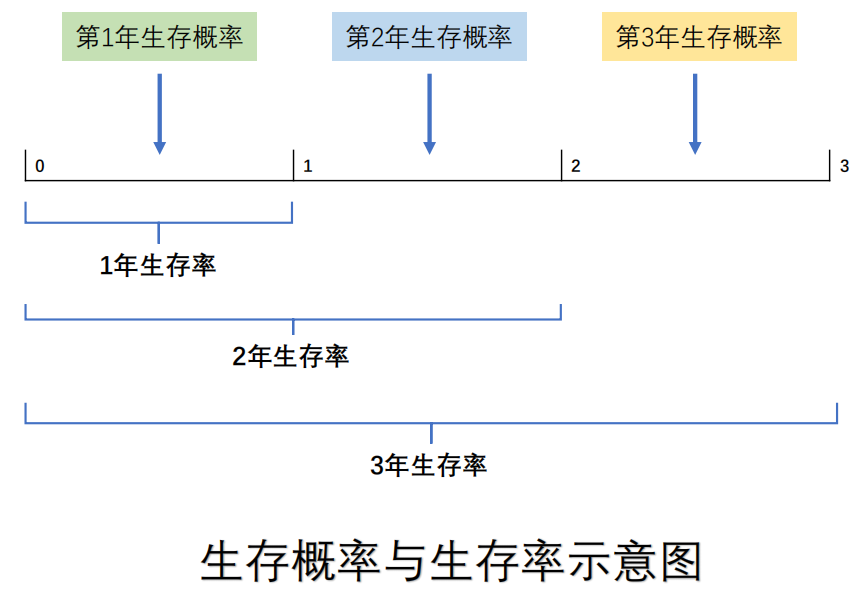
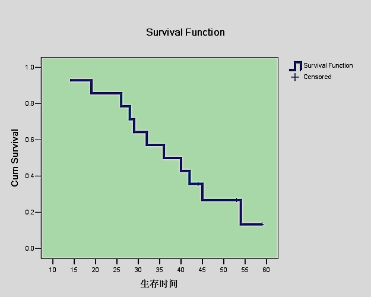
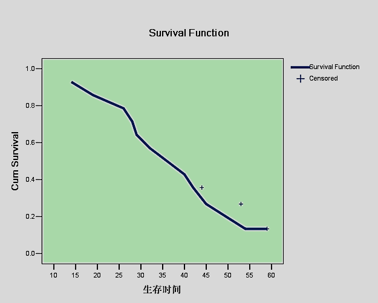
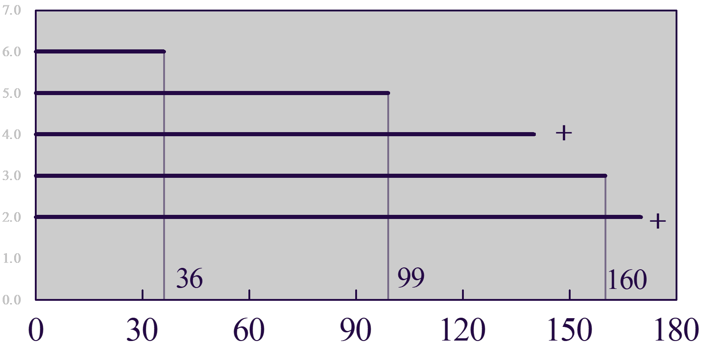
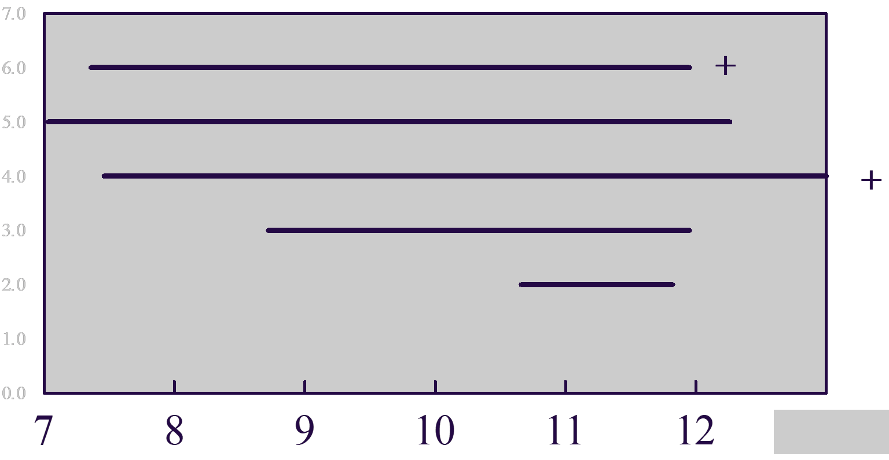
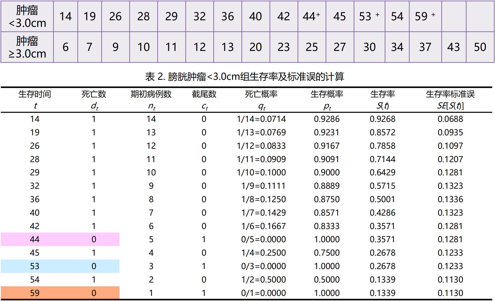
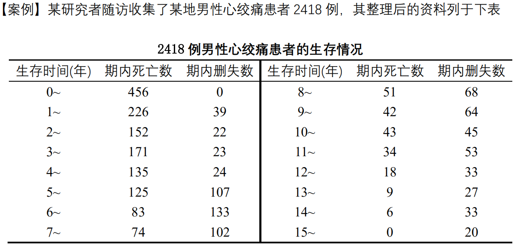
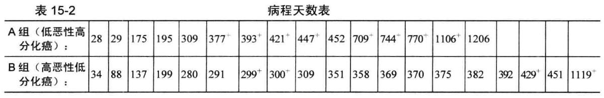

# **生存分析**

## 生存资料的描述

### 生存分析方法的正确表达

阅读临床研究文献的时候经常看到如下表述，这其中的统计学方法该何如理解？

➢ Aims compared treatments with respect to time to LR, time to distant 
recurrence, RFS, and OS via log-rank and Cox regression methods. Log-rank tests were exact, being based on hypergeometric probabilities. RFS and OS curves were estimated using the Kaplan-Meier method.

➢ Time-to-event curves were estimated by the Kaplan–Meier method and 
compared with the use of a two-sided log-rank test.

### 生存分析的基本概念

➢ 生存资料(time to event)的统计方法统称为生存分析，(survival analysis)，它是将事件的结局和发生这种结局所经历的时间两个因素综合起来分析的一种统计方法。它能够处理截尾数据，并对整个生存过程进行分析或比较

### 生存分析的几个重要名词

➢ **1. 终点事件:**

终点事件 (terminal event)又称失效事件(failure event)或“死亡”事件(deathevent) ，泛指标志某种措施失败或失效的事件或反映治疗效果特征的事件，是根据研究目的确定的。如乳腺癌术后死亡、白血病化疗后复发、肾移植术后的肾衰、术后下床活动等，均可作为“死亡”事件。 

➢ 【举例】RFS该如何定义？
字面意思是“无复发生存”，那“结局事件”一般定义为：复发+转移+复发同时转
移+癌症相关死亡，其余为“删失”

➢ **2. 生存时间:**

生存时间(survival time)也是一个广义概念，泛指所关心的某现象的持续时间，即
随访观察持续的时间，常用符号t表示

➢ **3. 死亡概率:**

死亡概率(probability of death)表示单位时间段开始存活的个体，在
该段时间内死亡的可能性。符号q表示。

$$
q= \cfrac{某年内死亡人数}{某年年初人口数}
$$


➢ **4. 生存概率:**

生存概率(probability of survival)表示单位时间段开始存活的个体，
到该段时间结束时仍存活的可能性。符号p表示

$$
p=\cfrac{某年活满一年人数}{某年年初人口数}
$$

$$
p=1-q
$$


➢ **5. 生存率:**

生存率(survival rate, survival function)表示观察对象经历tk个单位
时间段后仍存活的可能性。

若无截尾数据，则:

$$
S(t_k)= P(T>t_k) = \cfrac{t_k时刻仍存活的例数}{观察总例数}
$$


其中：

$$
0≤S(t)≤1
$$


若有截尾数据，须分时段计算生存概率。假定观察对象在各个时段的生存事件独立，应用概率乘法定理：


$$
S(t_k)= P(T>t_k) = p_1 ·p_2 \cdots p_k
$$

Pi 是某时段的生存概率，故生存率又称累积生存概率 (Cumulative 
Probabilityof Survival)。


**生存率与生存概率的区别**

```{r,echo=FALSE}


```

➢ **6. 生存曲线:**

生存曲线(survival curve)：生存时间为横轴，将各时点所对应的生
存率连接在一起的曲线图。

```{r,echo=FALSE}


```


### 生存数据的两种类型

➢ 完全数据(complete data)：指从观察起点到发生“死亡”事件所经历的时
间。提供了观察对象确切的生存时间。

➢ 截尾数据(censored data)：亦称截尾值(censored value)或终检值。指从
观察起点到发生非“死亡”事件所经历的时间。

**截尾原因大致有三种情况：**

➢ 失访：未继续就诊、拒绝访问或搬迁而失去联系。

➢ 死于与研究疾病无关的原因：由于其他原因死亡。

➢ 研究终止：研究结束时终点事件尚未发生。

➢ 截尾数据不能提供完全的信息，真实的生存时间未知，只知道比观察到的截尾时间长，常用符号“＋”表示

**生存资料的特点：**

➢ 有生存结局、生存时间

➢ 有不确定数据（截尾数据）

➢ 分布呈指数分布、Weibull分布、对数正态分布、对数logistic分布等


### 生存分析的主要任务
➢ 统计描述：

计算生存率、绘制生存率曲线、计算中位生存时间等。

➢ 统计推断：

估计总体生存率的可信区间、生存率曲线的比较。

### 生存分析基本方法

➢ 非参数法: 不论资料是什么样的分布类型，只根据样本提供的顺序统计量对生存率进行估计，常用乘积极限法和寿命表法。 

➢ 参数法: 假定生存时间服从于特定的参数分布，根据已知分布的特点对影响生存的时间进行分析，常用指数分布法、Weibull分布法、对数正态回归分析法和对数Logistic回归分析法。

➢ 半参数法: 介于参数法和非参数法之间，一般属多因素分析方法，用于探讨生存过程的主要影响因素，其经典方法是Cox比例风险回归模型。

### 随访研究的几个问题

#### 随访时间

➢ **1. 开始随访的时间：**

入(出)院时间、确诊时间、开始治疗时间等可作为随访开始的时间。如乳腺癌的乳腺切除术后第一天或出院日、白血病化疗后缓解出院日等，也可规定开始治疗日为随访开始时间。

➢ **2. 随访结局和终止随访时间: **

随访的结局可能有以下几种：

(1) 死亡：泛指处理措施失败的事件。如肿瘤化疗后的复发、肾移植因肾衰或与之有关的原因而死亡等。终止随访时间为“死亡”时间。

(2) 失访：拒绝随访、失去联系或中途退出等。终止随访时间为最后一次时间。

(3) 死于与研究疾病无关的原因：终止随访时间为死亡时间。

(4) 研究终止。研究终止时观察对象仍然存活。终止随访时间为研究终止时间。

➢ **3. 影响生存的有关因素：**

如患者年龄、病情、病程、术前健康等情况，以便分析这些因素对生存率的影响。


#### 随访方式

**1. 规定时点入组，统一分组，同一起点开始随访**

全部观察对象同时接受处理措施，观察到最后一例出现结果或事先规定的随访截止时间。

```{r,echo=FALSE}


```


**2. 研究对象入组时间不定，随时入组，即刻随访**

观察对象在不同时间接受处理措施，完成一定数量随访病例或按事先规定的时间停止随访

```{r,echo=FALSE}


```


## 生存率的估计与生存曲线

### Kaplan-Meier法


➢ 乘积极限法(product-limit estimate)又称Kaplan-Meier法，适用于分组生存资料的分析，需要***已知每例患者的生存时间与状态***

【案例】14例膀胱肿瘤 < 3.0cm患者和16例膀胱肿瘤 ≥3.0患者的生存时间（月）如下，试估计两组各时点生存率及其标准误、各时点总体生存率的95%可信区间、中位生存时间，并绘制生存曲线

```{r,echo=FALSE}

```


[1]. 生存时间t：由小到大排列，遇非截尾和截尾值相同，截尾值排后。

[2]. 死亡数dt：与生存时间t对应。注意：截尾值对应的个体未发生“死亡”事件，故死亡数为0。 

 [3]. 期初病例数nt，表示恰好在该时刻以前的病例数。如n29为10，表示恰好在29月时点前有10人存活。

 [4]. 死亡概率qt，表示t月前的观察对象恰好在t月时点死亡的概率。

 [5]. 生存概率pt，表示t月前的观察对象恰好在t月时点存活的概率。

 [6]. 生存率S(t)。表示该人群恰好活过t 时刻的概率。它为小于和等于 t 时刻的各时点生存概率的乘积。

 [7]. 生存率的标准误SES(t) 。

$$
SE[S(t)]=\sqrt{\cfrac{1-S(t)}{n_t-d_t}}
$$

➢ **总体生存率的可信区间计算**

假定生存率近似服从正态分布，某时点总体生存率的（1－a）％可信区间，公
式为：

$$
S(t) \pm u_{\alpha /2}SE[S(t)]
$$

本例28月总体生存率的95％可信区间：$0.7144 \pm 1.96 \times 0.1207$

即膀胱肿瘤<3.0cm患者28月生存率的95%可信区间为47.78％~95.10%。生存曲线尾部的生存率不适合于用该法计算总体生存率的可信区间。

➢ **中位生存时间计算: **

由表2可见，中位生存时间估计在36月。

采用线性内插法计算：找到与生存率50％相邻的上下两个生存率及其生存
时间，利用线性比例关系求解中位生存时间（后面有举例）。
若生存率0.5处所对应的曲线与X轴平行，则中位生存时间不止一个。

**若各时间点生存率均大于50％，则无法估计中位生存时间。**


### 寿命表法

➢ 适用于**未分组**的生存资料，不需要知道每例患者的生存时间与状态。

①. 实际工作中，随访结果常常没有每个观察对象确切的生存时间，只能获得按随访时间分段的资料。

②. 当样本较大(如 n ≥ 50)时，采用乘积极限法估计生存率及其标准误往往较为繁琐。

```{r,echo=FALSE}

```


➢ **生存率的计算: **

1. 确诊后年数t～：“0～”表示从确诊日起不满一年，“1～”表示确诊后1年至不满2年，依次类推。

2. 期内死亡数dt ：指期内死于某恶性肿瘤的人数。

3. 期内截尾数ct：泛指具有截尾数据的人，表示随访已满t年，但在未满t+1月期间失访的人。

4. 期初观察例数n’t ：指时刻t以前的人数。

5. 期初有效例数nt ：相当于实际观察人时数。在各年年初观察人数中减去同年截尾数的一半。

6. 死亡概率qt，指活满t年的病人在t＋1年内死亡的的概率。

7. 生存概率pt，指活满t年的病人在t＋1年内存活的概率。

8. 生存率S(t)，表示活过t年的概率。它为小于和等于 t 时刻的各时点生存概
率的乘积。

9. 生存率的标准误SES(t) 。

### 生存分析对生存资料的基本要求

(1) 样本由随机抽样方法获得，并应有足够的数量；

(2) 死亡例数不能太少(≥30)； 

(3) 截尾值比例不能太大；

(4) 生存时间尽可能精确到天数，因为多数生存分析方法都在生存时间排序的基础上作统计处理的，即使是小小的舍入误差，也可能改变生存时间顺序而影响结果。


### Kaplan-Meier法估计案例

【案例】我们将使用`ISwR`包中包含的恶性黑色素瘤后的生存数据集(melanom)，该数据集信息如下

**描述**：该数据集包含205行、7列，包含了患恶性黑色素瘤病人术后的生存数据，由 Odense 大学医院的K.T.Drzewiecki收集。

**用法**：`melanom` 

**格式**：该数据框包含如下列∶

`no`: 数值向量，病人编号。

`status`: 数值向量，编码表示生存状态

- 1∶死于黑色素瘤

- 2∶存活

- 3∶死于其他原因

`days`: 数值向量，观测时间。

`ulc`:数值向量编码， `ulceration`:

- 1∶存在; 2∶缺失

`thick`: 数值向量，肿瘤厚度（1/100 mm）。

`sex` 数值向量编码;

- 1∶女性，2;男性。


*代码如下：*

```{r,message=FALSE}

library(survival)
library(ISwR)
attach(melanom)
names(melanom)
Surv(days, status==1) #定义资料中的终点
survfit(Surv(days, status==1)~1)#将其拟合，可以看到简要的信息
surv.all <- survfit(Surv(days,status==1)~1)
summary(surv.all)
plot(surv.all,col="#009999")#绘制带可信区间的生存曲线
#拟合以性别作为分组的函数
surv.bysex <- survfit(Surv(days,status==1)~sex)
plot(surv.bysex)
plot(surv.bysex, conf.int=T, col=c("#3399CC","#FF0099"))
#画出的生存曲线过于凌乱，我们可以隐藏可信区间
plot(surv.bysex, conf.int=F, col=c("#3399CC","#FF0099"))
detach(melanom)
```

### LifeTable寿命表法

➢ 【案例】某医生比较两种药物治疗HIV感染患者后的生存时间t(月)，试用寿命表
法分析患者生存时间

```{r}
hmohiv<-read.table("data/hmohiv.csv", sep=",", header = TRUE)
attach(hmohiv)
head(hmohiv)
library(KMsurv)
library(nlme)
t6m<-floor(time/6)
tall<-data.frame(t6m, censor)
die<-gsummary(tall, sum, groups=t6m)#分组
total<-gsummary(tall, length, groups=t6m)
rm(t6m)
ltab.data<-cbind(die[,1:2], total[,2])
detach(hmohiv)
attach(ltab.data)
lt=length(t6m)
t6m[lt+1]=NA
nevent=censor
nlost=total[,2] - censor
mytable<-lifetab(t6m, 100, nlost, nevent)
mytable[,1:5]
plot(t6m[1:11], mytable[,5], type="s", xlab="Survival time in every 6 month", 
     ylab="Proportion Surviving")
detach(ltab.data)
```


这段代码与分析结果又臭又长，很不好理解。但是实际上在临床中将数据收集成寿命表形式是一个非常愚蠢的行为，这段代码大部分精力都集中于如何将原始数据转换为寿命表，所以没有什么掌握的必要，看看就好，提醒自己不要做这种愚蠢的事情。如果真的做了，可以投入SPSS的怀抱，比用R语言好的多（大概他们做包的时候没有想到会有这么蠢的人）。


## 组间生存曲线的比较

### Log-rank检验

➢ 对数秩检验，非参数检验法，其零假设为两总体生存曲线相同，但检验过程一
般不估计生存率，而利用死亡数和死亡率函数作统计推断。

➢ 基本思想：当$H_0$成立时，根据t时点的死亡率，计算出各组的理论死亡数，则
检验统计量：

$$
\chi^2 = \cfrac{(A_g-T_g)^2}{V_g} 
\quad 
\quad 
V_g= \sum \cfrac{n_{gi}}{ni}(1-\cfrac{n_{gi}}{ni})(\cfrac{n_i-d_i}{n_i-1})d_i
$$

亦可用公式： $\chi^2=\sum \cfrac{(A-T)^2}{T}$
检验统计量$\chi^2$近似服从$v=(组数-1)$的$\chi^2$分布

➢ Log-rank检验应用及注意事项：

[1]. 相对死亡比（relative death ratio）：实际死亡数A与理论死亡数T之比，
则相对危险度（relative risk , RR）估计值为两组相对死亡比率之比。

$$
RR=\cfrac{R_1}{R_2}=\cfrac{A_1 / T_1}{A2/T2}
$$


[2]. log-rank检验：用于整条生存曲线的比较，若比较两条生存曲线某时点的
生存率，如2年生存率，按下式:


$$
u=\cfrac{S_1(t)-S_2(t)}{\sqrt{SE^2[S_1(t)]+SE^2[S_2(t)]}}
$$


[3]. 若比较多个时点生存率，检验水准应取Bonferroni校正，即$\alpha'=\alpha/k$其中k为比较次数，以保证总的Ⅰ型错误概率不超过α。

[4]. log-rank检验：单因素分析，应用条件是除比较因素外，影响生存率的各混杂因素组间均衡可比，否则采用Cox比例风险回归模型。

[5]. 对数秩检验也可用于三组生存曲线的比较。


[6]. 由对数秩检验过程可知，若每一时点A组死亡率都高一点(生存率低一点)，则检验结果必然为A不同于B。因此，在比较的两条生存率曲线无交叉时，直接用对数秩检验是合适的。反之，就需进一步分析原因，了解是否存在混杂因素的影响。

### 案例1

例 观察两组卵巢腺癌患者的病程天数如下。请用乘积极限法进行描述，并比较两组的生存期差异有无统计学意义，并作生存率曲线。如表15-2 所示。

```{r,echo=FALSE}

```

```
#install.packages("survival")
library(survival)
example15_3 <- read.table ("data/example15_3.csv", header=TRUE, sep=",")
attach(example15_3)
t1<-as.numeric(example15_3$t)
total <- survfit(Surv(t1, censor)~1)
summary(total)
plot(total,conf.int = F)
separate <- survfit(Surv(t1, censor)~group)
summary(separate)
plot(separate, lty = c('solid','dashed'), col=c('black','blue'),
     xlab='survival time in days',ylab='survival probabilities')
legend('topright', c('Group A',' Group B'), lty=c('solid','dashed'),
       col=c('black','blue'))
survdiff(Surv(t1, censor)~group)
survdiff(Surv(t1, censor)~group,rho=1) 
# rho = 1 it is equivalent to the Peto & Peto modification of the Gehan-Wilcoxon test.
```


### 案例2

```{r,message=FALSE}
library(coin)
data(glioma)
attach(glioma)
library(survival)
g3 <- subset(glioma, histology =='Grade3')#取亚集

fit <- survfit(Surv(time, event)~group,data = g3)
plot(fit, lty = c(2,1), col = c(2,1))
legend('bottomright', legend = c('Control','Treatment'), lty = c(2,1), col = c(2,1))

survdiff(Surv(time, event)~group,data = g3)

logrank_test(Surv(time, event)~group,data = g3, distribution ="exact")
logrank_test(Surv(time, event)~group|histology,data = glioma, distribution = approximate(B = 1000)) #两组比较,coin包 logrank_test函数#SurvivalTests {coin}
```


## 画一幅高水准的生存曲线

```{r,message=FALSE}
library(survminer)
library(survival)

library(coin)
data(glioma)
attach(glioma)
g3 <- subset(glioma, histology =='Grade3')

fit <- survfit(Surv(time, event)~group,data = g3)

ggsurvplot(fit,
           pval = TRUE, # 在图上添加log rank检验的p值
           conf.int = TRUE,# 添加置信区间
           risk.table = TRUE, # 在图下方添加风险表
           risk.table.col = "strata", # 根据数据分组为风险表添加颜色
           linetype = "strata", # 改变不同组别的生存曲线的线型
           surv.median.line = "hv", # 标注出中位生存时间
           ggtheme = theme_bw(), # 改变图形风格
           palette = c("#E7B800", "#2E9FDF")) # 图形颜色风格


```

```{r}
ggsurvplot(
  fit,
  pval = FALSE,
  conf.int = TRUE,
  fun = "cumhaz",
  conf.int.style = "ribbon",  # 设置置信区间的风格
  xlab = "Time in days",   # 设置x轴标签
  break.time.by = 20,     # 将x轴按照20为间隔进行切分
  ggtheme = theme_light(), # 设置图形风格
  risk.table = "abs_pct",  # 在风险表中添加绝对数和相对数
  risk.table.y.text.col = TRUE,# 设置风险表的文字颜色
  risk.table.y.text = FALSE,# 以条柱展示风险表的标签，而非文字
  ncensor.plot = TRUE,      # 展示随访过程中不同时间点死亡和删失的情况
  surv.median.line = "hv",  # 添加中位生存时间
  legend.labs =
    c("Male", "Female"),    # 改变图例标签
  palette =
    c("#FF6666", "#33CC66") # 设置颜色
)
```


```{r}
ggsurvplot(fit,
           conf.int = TRUE,
           risk.table.col = "strata",
           ggtheme = theme_bw(),
           palette = c("#009999", "#CCCC00"),
           fun = "cumhaz")
dev.off()
```


