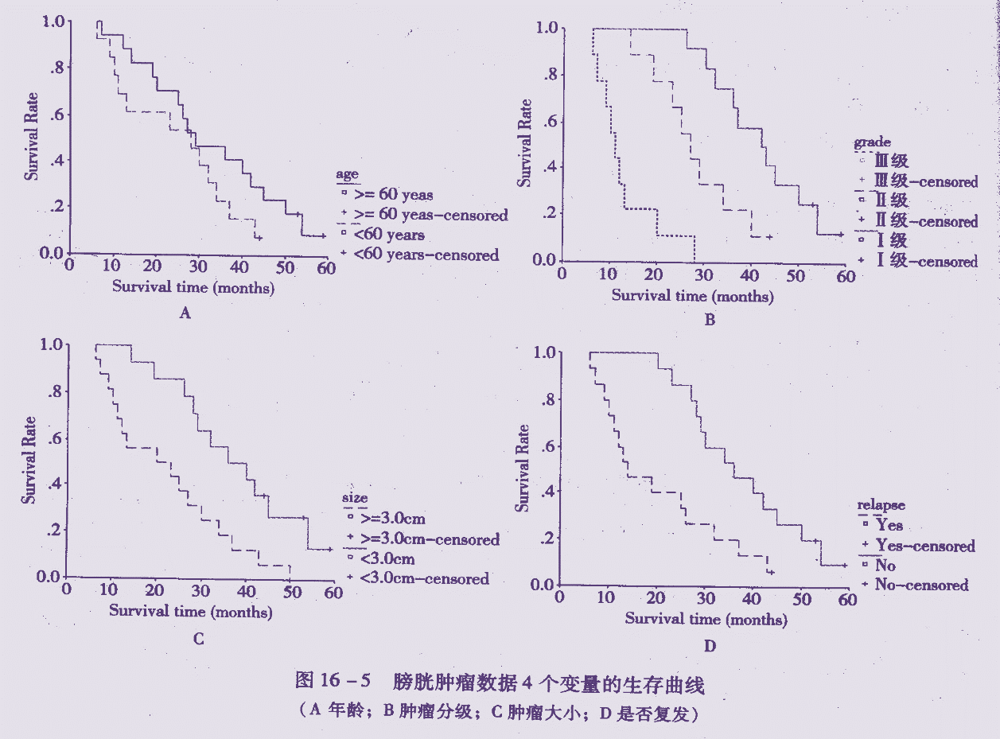
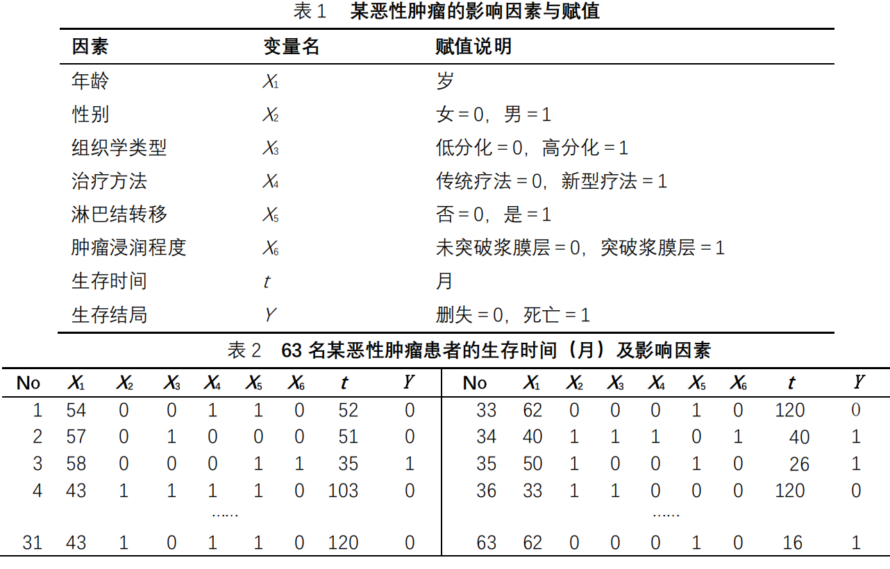
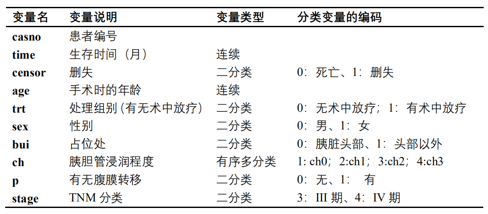
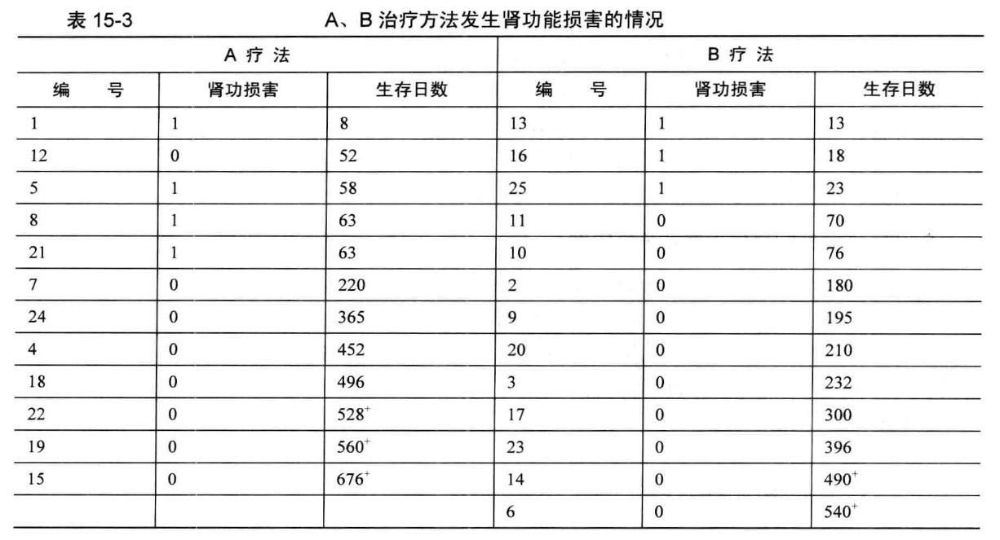

# **COX比例风险模型**

## **模型简介**

➢ 1972年，英国统计学家 D. R. Cox 博士提出了一种比例风险回归模型（Cox Proportional Hazard Model），简称Cox模型。它可以分析多种因素对生存时间的影响，而且允许有“截尾”存在。是生存分析中最重要的模型之一。

➢ Cox回归模型主要用于肿瘤和其它慢性病的预后因素分析，也可以用于一般的临床疗效评价和队列的病因探索。

### COX模型的基本结构

➢ COX模型不直接考察生存时间与各自变量的关系，而是用风险率作为因变量。

COX模型的基本结构为：

$$
h(t,X)=h_0(t)\exp(\beta_1X_1+\beta_2X_2+\cdots+\beta_mX_m) \quad \quad (1)
$$

➢ $h(t,X)$：t时点上m个危险因素起作用时的风险率，即在时间t上的死亡率；

➢ $h0(t)$：某时间t上当m个危险因素为0时的基准风险率；

➢ $X(X_1, X_2,…, X_m)$：与生存时间可能有关的自变量；

➢ $β＝(β_1, β_2,…, β_m)$：COX模型的回归系数。


➢ $β_j$与$h(t,X)$之间有如下关系：

（1）$β_j>0$，则$X_j$取值越大，$h(t,X)$的值越大，表示病人死亡的风险率越大；

（2）$β_j＝0$，则$X_j$取值对$h(t,X)$无影响；

（3）$β_j<0$，则$X_j$取值越大，$h(t,X)$的值越小，表示病人死亡的风险率越小。

➢ $h(t)$和$h_0(t)$成比例，比例系数是：

$$
h(t,X) / h_0(t) = \exp(\beta_1X_1+\beta_2X_2+\cdots+\beta_mX_m)
$$

➢ 故COX模型又称比例风险模型，将上式两边取自然对数，得：

$$
\ln[h(t,X) / h_0(t)]=\beta_1X_1+\beta_2X_2+\cdots+\beta_mX_m
$$
➢ 此式与多元线性回归模型非常类似，故有人称COX模型为COX回归。

➢ 由此式可见$β_j$的含义是：在其他自变量不变前提下，自变量$X_j$改变一个单位，引
起的死亡风险改变的自然对数值。


式(1)可改写为：

$$
h(t,X)=h_0(t)\exp(\beta_1X_1)\exp(\beta_2X_2) \cdots \exp(\beta_mX_m)
$$
故相对危险度(RR)即：


$$
\text{RR} = \exp\beta_j(X_{j2}-X_{j1}) 
$$


如Xj为 0~1 数据，则：$\text{RR} = \exp\beta_j$

➢ RR含义：在其他自变量保持不变前提下，自变量$X_j$改变一个单位，死亡风险比原水平改变$\exp(\beta_j)$倍。**RR是一个与时间无关的变量** 。

h0(t)分布类型未作任何限定；但h(t)随变量X的变化假定为指数函数exp(bX)。故COX模型为半参数模型。而且h0(t)分布类型未作任何限定，因而应用COX模型不必考虑资料的属于那一种具体的分布。故适用范围广泛，类似于非参数方法，但其检验效率高于非参数模型，接近于参数模型。


### COX回归模型的构建


➢ 构造偏似然函数，然后用最大似然法求出各参数估计值bj, 须借助计算机完成。


### COX回归模型的主要用途

（1）建立以多个危险因素估计生存或死亡的 风险模型，并由模型估计对多个
危险因素导致死亡的相对危险度（RR)

（2）用已建立的模型，估计患病后随时间变化的生存率

（3）用已建立的模型，估计患病后的危险指数, 或预后指数（PI）

### COX回归模型的应用条件

（1）已知观察对象的生存时间；

（2）已知观察对象在事先确定的观察时间内，其是否发生某事件的结果；

（3）自变量可以是计量资料、计数资料、分类资料或等级资料。

（4）等比例风险（PH）。指在协变量不同状态的病人的风险在不同的时间保
持不变。如在研究的10年中，糖尿病人心脏病发作的可能性是非糖尿病人的3
倍，无论在第1年，第2年…….等都如此。


***等比例风险的验证***

（1）按协变量分组的Kaplan-Meier生存曲线，如生存曲线明显交叉，则不满足PH假定。

```{r, echo=FALSE}

```


（2）将协变量与时间作为交互项引入模型，如果交互项没有统计学意义，则等比例风险成立，若有统计学意义，则不成立。与时间有关的风险称为非比例风险，采用非比例风险模型分析。

### COX回归分析的假设检验

（1）Cox回归方程的检验方法：

➢ 最大似然比检验（maximumLike-lihood Ratio)

➢常用Wald检验、得分检验（Score)


## COX分析的一般步骤

### 收集资料

首先确定观察指标并将其数量化，表1（数量化表），然后收集资料，表2（随访表）。收集到资料后，建立数据文件。（用SPSS或Excel)

```{r,echo=FALSE}

```


### 因子初步筛选

1. 剔除数据缺失较多的因子

2. 剔除变异几乎为0的因子

3. 对所有因子逐个做单因素Cox模型分析，选择有统计学意义的变量做多因素Cox模型分析,此时的α值可以取稍大一些，如α=0.1.


### 拟合多因素模型
    
  规定检验水准α，初步探索性研究，可取α=0.10或α=0.15,；严谨的、证实性研究，取α=0.05或0.01
    
  筛选因子方法：前进法、后退法、逐步法


### 结果解析与评价
    
  1. 模型在一定的检验水准α下，入选哪些因素？
    
  2. 入选因素哪些是保护因素，哪些是危险因素？
    
  3. 入选因素哪个对因变量影响（贡献）最大？


### 标准回归系数的计算方法
    
对原始变量的观察值做标准正态化变换后，在拟合回归方程得到的回归系数，即为标准化回归系数
    
  可直接用以下公式计算：

$$
\beta'=SD   · \beta
\; \; \; \; \; \; \;
SE(\beta')=SD ×SE(\beta)
$$
      式中，SD为X的标准差,SE(β)为β的标准误
      
      
## **案例**
      
### 案例1

以下数据是一项关于胰脏癌手术中接受放射治疗是否会延长病人生存时间的研究数据。该研究的主要终点为死亡，接受手术被定义为计算生存时间的起点。由于该研究是一项未经随机化的观察性研究，要正确估计术中接受放射治疗提高患者生存时间的效果，还需要考虑对其他因子的效果进行调整。数据的详细说明见下表。

```{r,echo=FALSE}

library(foreign)
pancer <- read.spss('data/pancer.sav')
pancer <- as.data.frame(pancer)
m.kable<-head(pancer)
knitr::kable(m.kable)
```


**代码清单**

1. 导入数据

```{r,results='hide'}
library(foreign)
library(survival)
pancer <- read.spss('data/pancer.sav')
pancer <- as.data.frame(pancer)
head(pancer)
```

2.定义变量名


```{r}
pancer$censor <- ifelse(pancer$censor=='死亡',1,0)
pancer$Gender <- as.factor(ifelse(pancer$sex=='男',"Male","Female"))
pancer$ch <- as.factor(ifelse(pancer$ch=='CH3', "ch","nonch"))
```


在这行代码
`ifelse(pancer$ch=='CH3', "ch","nonch")`中，我们将ch3，作为有胆管浸润，将0、1、2实际上定义为了无胆管浸润，现在可以看看数据发生了什么改变：

```{r,echo=FALSE}
m.kable2<-head(pancer)
knitr::kable(m.kable2)
```


3. 拟合模型

```{r,tidy=TRUE,comment=''}
#pancer$ch <- relevel(pancer$ch,ref="CH0") #设置因子的参照水平
#pancer$ch<- factor(pancer$ch,order=TRUE) #设置为等级变量
#options(contrasts=c("contr.treatment", "contr.treatment")) #指定等级变量的参照水平
#pancer$Gender <- relevel(pancer$Gender,ref='Female')

f<-coxph(Surv(time,censor==1)~age+Gender+trt+bui+ch+p+stage,data=pancer)
summary(f)

```

***结果解读1.1***

- `exp(coef)`即回归模型的反对数，可以将其近似的看做RR值。

- `Likelihood ratio test`; `Wald test`; `Score (logrank) test` 即回归模型的似然比检验、瓦尔德检验以及比分检验的结果、自由度和P值。

- `Concordance= 0.646` 即C统计量


4. 计算C统计量的95%可信区间


公式如下：

$$
\text{95%CI}= \text{C-index} \pm 1.96\text{SE(c)}
$$

```{r}
sum.surv<-summary(f)
c_index<-sum.surv$concordance
c_index

0.64582715+1.96*0.03617383 #95%CI上限

0.64582715-1.96*0.03617383 #95%CI下限
```


***结果解读 1.2***

- C统计量的95%CI为：0.03617383~0.03617383


### 案例2

随访25例分别以A 、B 治疗方法治疗的癌症病人的生存情况，资料如表15-3 所示，+为截尾值。1 : 有肾功能损害， 0: 无肾功能损害

```{r,echo=FALSE}

```


查看原始数据

```{r,echo=FALSE}
example15_4  <- read.table ("data/example15_4.csv", header=TRUE, sep=",")
attach(example15_4)
kb<-head(example15_4)
knitr::kable(kb)
detach(example15_4)
```


**代码如下**

```{r,message=FALSE}
library(survival)
example15_4  <- read.table ("data/example15_4.csv", header=TRUE, sep=",")
attach(example15_4)
coxmodel  <- coxph(Surv(days, censor)~group)
summary(coxmodel)
coxmode2  <- coxph(Surv(days, censor)~group+renal)
summary(coxmode2)
anova(coxmodel,coxmode2)
detach(example15_4)
```


### 案例3

```{r,message=FALSE,tidy=TRUE}
library(TH.data)
data('GBSG2',package = 'TH.data')
attach(GBSG2)
head(GBSG2)
# ff<-survfit(Surv(time, cens)~horTh,data = GBSG2)
# summary(ff)
plot(survfit(Surv(time, cens)~horTh,data = GBSG2),lty = c(2,1), col = c(2,1), mark.time = T)
legend('bottomright', legend = c('yes','no'), lty = c(2,1), col = c(2,1))
```


***结果解读 2.1***

- 我们可以通过`summary()`函数可以看到预后情况，寻找中位生存时间，确定不同组的生存情况

- 也可以画一条生存曲线

```{r}
coxreg <- coxph(Surv(time,cens)~.,data = GBSG2) #~后加"."指加入所有的变量
summary(coxreg)

```


## 列线图绘制


载入数据

```{r,message=FALSE}
library(foreign)
library(survival)
library(rms)

pancer <- read.spss('data/pancer.sav')
pancer <- as.data.frame(pancer)
head(pancer)
```


重命名变量

```{r}
pancer$censor <- ifelse(pancer$censor=='死亡',1,0)
pancer$Gender <- as.factor(ifelse(pancer$sex=='男',"Male","Female"))
pancer$ch <- as.factor(ifelse(pancer$ch=='CH3', "ch","nonch"))#将等级变量二值化
```


也可使用这种方式设置哑变量

```{r}
#pancer$ch1 <- as.factor(ifelse(pancer$ch=='CH1',1,0))
#pancer$ch2 <- as.factor(ifelse(pancer$ch=='CH2',1,0))
#pancer$ch3 <- as.factor(ifelse(pancer$ch=='CH3',1,0))
#pancer$ch0 <- as.factor(ifelse(pancer$ch=='CH0',1,0))

#pancer$ch <- relevel(pancer$ch,ref="CH0") #设置因子的参照水平
#pancer$ch<- factor(pancer$ch,order=TRUE) #设置为等级变量
#options(contrasts=c("contr.treatment", "contr.treatment")) #指定等级变量的参照水平
#pancer$Gender <- relevel(pancer$Gender,ref='Female')
```

```{r}
#打包数据
dd<-datadist(pancer)
options(datadist='dd')

coxm1 <- cph(Surv(time,censor==1)~age+Gender+trt+bui+ch+p+stage,
             x=T,y=T,
             data=pancer,
             surv=T)#rms包中的cox回归
coxm1
```

```{r}
surv <- Survival(coxm1)
# 定义时间分割的范围，以月为单位
surv1 <- function(x)surv(1*3,lp=x)
surv2 <- function(x)surv(1*6,lp=x)
surv3 <- function(x)surv(1*12,lp=x)

nom1<-nomogram(coxm1,fun=list(surv1,surv2,surv3),
               lp= F,
               funlabel=c(
                 '3-Month Survival probability',
                 '6-Month survival probability',
                 '12-Month survival probability'),
               maxscale=100,
               fun.at=c('0.9','0.85','0.80','0.70',
                        '0.6','0.5','0.4','0.3','0.2','0.1')
               )

# fun：将线性的预测转换为具体的分值
# lp= F：不显示线性预测值，只显示最后的分值
# funlabel：不同时间的标签
# maxscale=100 刻度为0~100
# fun.at设置最后结果的范围


plot(nom1,xfrac=.60)#xfrac为文字和图的距离
```

从图中我们可以看到，Gender和ch两个变量对模型的意义不大，我们可以尝试删除这两个变量。

拟合一个新的模型

```{r}
coxm2 <- cph(Surv(time,censor==1)~age+trt+bui+p+stage,
             x=T,y=T,data=pancer,surv=T)
coxm2
```

我们可以看到c统计量实际上是有轻微的上升的，故用这个(coxm2)模型来绘制列线图

```{r,message=FALSE,warning=FALSE}
surv <- Survival(coxm2)
# 定义时间分割的范围，以月为单位
surv1 <- function(x)surv(1*3,lp=x)
surv2 <- function(x)surv(1*6,lp=x)
surv3 <- function(x)surv(1*12,lp=x)
#绘制列线图
nom2<-nomogram(coxm2,
               fun=list(surv1,surv2,surv3),
               lp= F,
               funlabel=c('3-Month Survival probability',
                          '6-Month survival probability',
                          '12-Month survival probability'),
               maxscale=100,
               fun.at=c('0.9','0.85','0.80','0.70','0.6',
                        '0.5','0.4','0.3','0.2','0.1','0.01'))
plot(nom2)
# 绘制校正曲线
cal2 <- calibrate(coxm2, cmethod='KM', method='boot', u=6, m=20, B=1000)
#u=6:时间间隔
#m=20：总样本量为83，设为20，就有4个节点，一般设置3~4个节点
plot(cal2,
     lwd=2,lty=1,
     errbar.col=c(rgb(0,118,192,maxColorValue=255)),
     xlim=c(0,1),ylim=c(0,1),
     xlab="Nomogram-Predicted Probabilityof 6 m OS",
     ylab="Actual 6 m OS (proportion)",
     col=c(rgb(192,98,83,maxColorValue=255)))
```


## 亚组分析森林图的绘制

```{r,message=FALSE}
library(forestplot)
test_forest <- read.csv('data/forest_test2.csv',header = FALSE)
attach(test_forest)
forestplot(labeltext = as.matrix(test_forest[,1:6]),
           #设置用于文本展示的列，此处我们用数据的前六列作为文本，在图中展示
           mean = test_forest$V7, #设置均值
           lower = test_forest$V8, #设置均值的下限
           upper = test_forest$V9, #设置均值的上限
           is.summary = c(T,T,F,F,T,F,F,T,F,F,F,F,T,F,F,F,T,F,T,F,F,T),
           #该参数接受一个逻辑向量，用于定义数据中的每一行是否是汇总值，若是，则在对应位置设置为TRUE，若否，则设置为FALSE；设置为TRUE的行则以粗体出现
           zero = 1, #设置参照值，此处我们展示的是HR值，故参照值是1，而不是0
           boxsize = 0.2, #设置点估计的方形大小
           lineheight = unit(10,'mm'),#设置图形中的行距
           colgap = unit(2,'mm'),#设置图形中的列间距
           lwd.zero = 2,#设置参考线的粗细
           lwd.ci = 2,#设置区间估计线的粗细
           lwd.xaxis=2,#设置X轴线的粗细
           xlog=FALSE,
           ci.vertices.height = 0.1,
           clip = c(0.2,1.3), # 设置森林图展示的可信区间范围，超过的部分用箭头展示
           grid = FALSE,
           lty.ci = 1,
           col=fpColors(box='#458B00',  summary= "#8B008B",lines = 'black',zero = '#7AC5CD'),
           #使用fpColors()函数定义图形元素的颜色，从左至右分别对应点估计方形，汇总值，区间估计线，参考线
           xlab="Hzard Ratio(HR)",#设置x轴标签
           graph.pos = 5)#设置森林图的位置，此处设置为5，则出现在第五列
```


注意：数据过多时，一张图可能画不下，故可以将数据分割，分成几次绘制。


