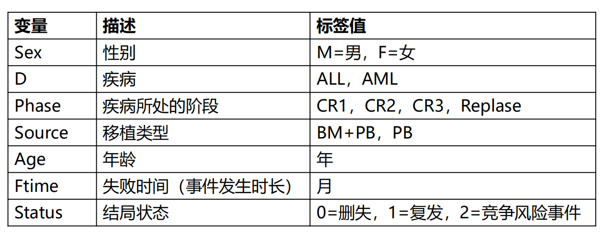

# **竞争风险模型**

## 竞争风险的概念

➢ 在观察某事件发生的时间，如果该事件被其他事件阻碍，即存在竞争风险

➢ 【举例】：研究骨髓移植对比血液移植治疗白血病的疗效，结局定义为“复发”，假定患者移植后不幸因为移植不良反应死亡，那这些发生移植相关死亡的患者就无法观察到“复发”的终点，也就是说“移植相关死亡”与“复发”存在竞争风险。

➢ 恶性肿瘤预后研究中这种例子很常见。


## 单因素竞争风险模型

```{r,echo=FALSE}

```


**1. 载入数据，并且将“D-疾病”这一列转化为因子变量**

```{r}
library(foreign)
bmt <-read.csv('data/bmtcrr.csv')
head(bmt)
bmt$D <- as.factor(bmt$D)
```

2. 加载程辑包，未下载的包可以使用`install.package()`下载。

```{r,message=FALSE}
library(survival)
library(cmprsk)
library(splines)
```
\

**3. 使用`cuminc()`函数拟合模型**

```{r}
attach(bmt)
crmod <- cuminc(ftime,Status,D)
crmod
```

***结果解读1***

- `$est` :列出了不同分组病人在不同时间点发生结局事件(1)和竞争事件(2)的率，

- 我们可以看到，1的发生率和2的发生率实质上并没有什么差别。
\

**3.画图**

```{r}
plot(crmod,xlab = 'Month', ylab = 'CIF',lwd=2,lty=1,
     col = c('#FF6699','#0066CC','#FFCC00','#99CC33'))
```


## 多因素竞争风险模型

在上部分的分析中，我们相当于只做了一个单因素的分析，如果要探讨每一种因素对“结局”的作用，可以使用`crr()`函数来构建一个多因素竞争风险模型。
\

**1. 整理数据：由于`crr()`函数需要数据为数据框类型的数据，所以在这里我们需要重新整理一下数据。**

```{r}
cov1 <- data.frame(age = bmt$Age,
                   sex_F = ifelse(bmt$Sex=='F',1,0),
                   dis_AML = ifelse(bmt$D=='AML',1,0),
                   phase_cr1 = ifelse(bmt$Phase=='CR1',1,0),
                   phase_cr2 = ifelse(bmt$Phase=='CR2',1,0),
                   phase_cr3 = ifelse(bmt$Phase=='CR3',1,0),
                   source_PB = ifelse(bmt$Source=='PB',1,0)) 
## 手动设置哑变量

head(cov1)
```


***结果解读 2.1***

- 我们可以看到，经过数据转换，生成了一个新的数据框`cov1`，在这个数据框中，性别由“1”和“0”表示。白血病类型以及移植类型也使用“1”和“0”表示。

- 需要注意的是，在`phase`这个变量中，有四种状态，如果粗暴的将其定义为“1~4”，计算机会将其作为等级资料处理，实际上他并没有顺序，所以我们还是使用老办法将其设置为协变量。
\


**2. 拟合模型**

```{r}
mod1 <- crr(bmt$ftime, bmt$Status, cov1, failcode=1, cencode=0)
summary(mod1)
```


***结果解读 2.2***

- 这个模型的结果展示和COX回归模型十分相似。我们可以看到每个不同因素的显著性，以及他们的 exp(coef)即HR值。

- 在这个模型中，phase_cr1、phase_cr2是有意义的，由于这是我们设置的phase这个变量对应的哑变量，所以我们可以说phase这个变量对结果是有意义的。

- 以source_PB为例，它的exp(coef)=2.512，说明控制了移植相关死亡的竞争风险之后，接受PB这种骨髓移植方式的病人发生定义的终点（复发）的风险比接受BM+PB这种方式发生终点的风险高2.512倍。

\


**3. 我们可以做一个卡方（瓦尔德）检验，看看拟合的模型是否有意义**

- 由于只有phase一个变量有意义，所以我们只纳入数据框的4~6列，也就是phase_cr1、phase_cr2以及phase_cr3。

```{r}
library(aod)
wald.test(mod1$var,mod1$coef,Terms = 4:6)
```

***结果解读2.3***

- 我们可以看到这个模型和空模型比较，p=0.0029，说明是有意义的。


