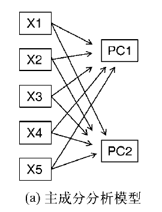
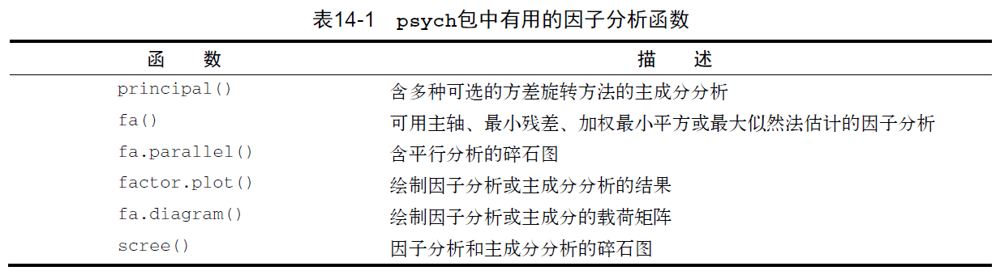
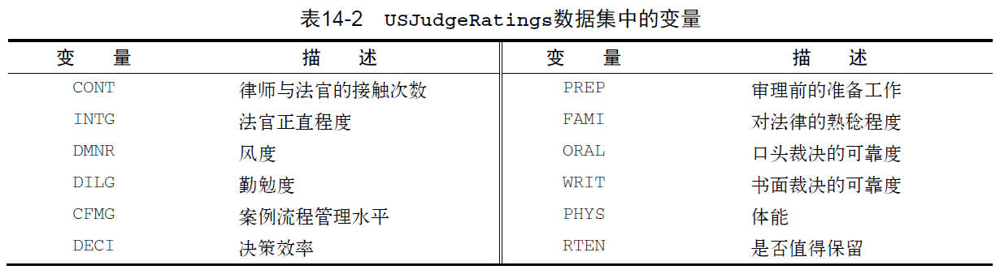
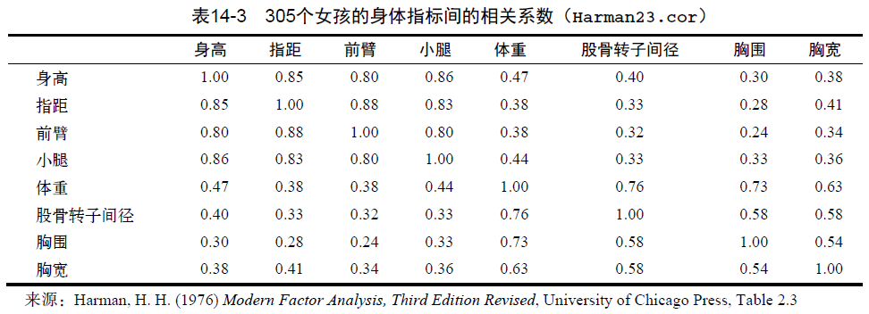
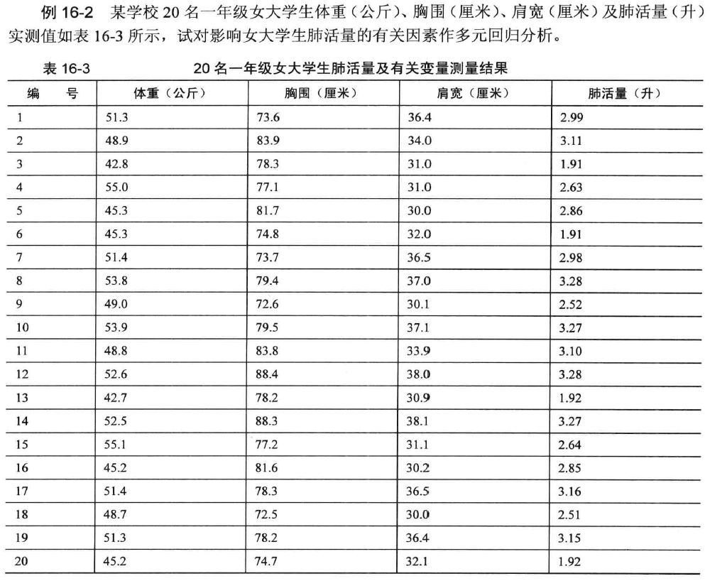

# **主成分分析**

## 概述

### 基本思想

基本思想——**降维**

➢ 主成分分析的基本思想就是将彼此相关的一组指标变量转化为彼此独立的一组新的指标变量，并用其中较少的几个新指标变量，综合反映原多个指标变量中所包含的主要信息，符合专业含义。


➢ 何为主成分? 简而言之，主成分实际上就是由原变量X1~Xm线性组合出来的m个互不相关、且未丢失任何信息的新变量，也称为综合变量。多指标的主成分分析常被用来寻找判断某种事物或现象的综合指标，并给综合指标所蕴藏的信息以恰当的解释，以便更深刻地揭示事物内在的规律。


### 模型示意图

```{r,echo=FALSE}

```


➢ 主成分分析（PCA）是一种数据降维技巧，它能将大量相关变量转化为一组少的不相关变量，这些无关变量称为主成分。使用PCA可将30个相关（很可能冗余）的环境变量转化为5个无关的成分变量，并且尽可能保留原始数据集的信息。


### 主成分分析基本思想应用

➢ 比如描述儿童生长发育的指标中，身高、腿长和臂长这3个指标可能是相关的，而胸围、大腿围和臂围这3个围度指标也会有一定的相关性。如果分别用每一个指标对儿童的生长发育做出评价，那么这种评价就是孤立的、片面的，而不是综合的。仅选用几个"重要的"或"有代表性"的指标来评价，就可能失去许多有用的信息，容易得出片面的结论。我们需要一种综合性的分析方法，既可减少指标变量个数，又尽量不损失原指标变量所包含的信息，对资料进行综合分析。


## 主成分分析的数学模型

假设原变量指标为$x_1$, $x_2$, …, $x_k$, 经过标准化后得到标准指标变量$X_1$, $X_2$，…，$X_K$:

$$
X_j=\cfrac{x_j-\bar x_j}{s_j}\;\;, \;\; j=1,2,\cdots ,k
$$

其中，$x_j$是第$j$个指标变量的均值,$s_j$是第$j$个指标变量的标准差。它们的综合指标(新变量指标)为$z_1, z_2, …, z_m, (m<k)$ 则进行线性变换:

$$
z_1=l_{11}X_1+l_{12}X_2+\cdots +l_{1k}X_k
$$

$$
z_2=l_{21}X_1+l_{22}X_2+\cdots +l_{2k}X_k
$$

$$
z_k=l_{k1}X_1+l_{k2}X_2+\cdots +l_{kk}X_k
$$


将$k$个标准指标变量$x_1, x_2, …, x_k$,转换成了$k$个新变量$z_1, z_2, …, z_k$


## PCA的R语言实现

### psych包中的函数

➢ R基础安装包提供了PCA和EFA的函数，分别是`princomp()`和`factanal()`。本章将重点介绍psych包中提供的函数。它们提供了比基础函数更丰富和有用的选项。

```{r,echo=FALSE}

```


### 主成分与因子分析的一般步骤

1. 数据预处理。

PCA和EFA都根据观测变量间的相关性来推导结果。用户可以输入**原始数据矩阵**或者**相关系数矩阵**到`principal()`和`fa()`函数中。若输入初始数据，相关系数矩阵将会被自动计算，在计算前请确保数据中**没有缺失值**。

2. 选择因子模型。

判断是PCA（数据降维）还是EFA（发现潜在结构）更符合你的研究目标。如果选择EFA方法，你还需要选择一种估计因子模型的方法（如最大似然估计）。

3. 判断要选择的主成分/因子数目。

4. 选择主成分/因子。

5. 旋转主成分/因子。

6. 解释结果。

7. 计算主成分或因子得分。


## 案例

### 案例1

➢ 数据集USJudgeRatings包含了律师对美国高等法院法官的评分。数据框包含43个观测，12个变量。表14-2列出了所有的变量。

```{r,echo=FALSE}

```


1. 设置种子数

```{r}
par(ask=TRUE)
set.seed(1234) # make results reproducible
```

2. 判断主成分的个数

```{r}
library(psych)
fa.parallel(USJudgeRatings[,-1], fa="pc", n.iter=100,
            show.legend=FALSE, 
            main="Scree plot with parallel analysis") 
abline(h=1,lwd=1,col="green") 
```

***结果解读1.1***

- 展示了基于观测特征值的碎石检验（由线段和x符号组成）、根据100个随机数据矩阵推导出来的特征值均值（虚线），以及大于1的特征值准则（y=1的水平线）。

- 图评价美国法官评分中要保留的主成分个数。碎石图（直线与x符号）、特征值大于1准则（水平线）和100次模拟的平行分析（虚线）都表明保留一个主成分即可


2. 提取主成分

`principal()`函数可以根据原始数据矩阵或者相关系数矩阵做主成分分析。格式
为：`principal(r, nfactors=, rotate=, scores=)` 其中：
➢` r` 是相关系数矩阵或原始数据矩阵；
➢ `nfactors`设定主成分数（默认为1）；
➢ `rotate`指定旋转的方法（默认最大方差旋转（`varimax`）；
➢ `scores`设定是否需要计算主成分得分（默认不需要）

```{r}
pc <- principal(USJudgeRatings[,-1], nfactors=1)
pc
```

***结果解读 1.2***

- 第一主成分（PC1）与每个变量都高度相关，也就是说，它是一个可用来进行一般性评价的维度。h2栏指成分公因子方差，即主成分对每个变量的方差解释度。u2栏指成分唯一性，即方差无法被主成分解释的比例（1–h2）。

- 例如，体能（PHYS）80%的方差都可用第一主成分来解释，20%不能。相比而言，PHYS是用第一主成分表示性最差的变量。SS loadings行包含了与主成分相关联的特征值，指的是与特定主成分
相关联的标准化后的方差值（本例中，第一主成分的值为10）。

- 最后，Proportion Var行表示的是每个主成分对整个数据集的解释程度。此处可以看到，第一主成分解释了11个变量92%的方差。


### 案例 2

Harman23.cor数据集包含305个女孩的8个身体测量指标。本例中，数据集由变量的相关系数组成，而不是原始数据集（见表14-3）。

```{r,echo=FALSE}

```


1. 判断主成分的个数

```{r}
library(psych)
fa.parallel(Harman23.cor$cov, n.obs=302, fa="pc", n.iter=100,
            show.legend=FALSE, main="Scree plot with parallel analysis")
abline(h=1,lwd=1,col="green")
```


***结果解读 2.1***

- 碎石图（直线和x符号）、特征值大于1准则（水平线）和100次模拟（虚线）的平行分析建议保留两个主成分


\

2. 提取主成分

```{r}
PC <- principal(Harman23.cor$cov, nfactors=2, rotate="none")
PC
```

***结果解读 2.2 ***

- 第一主成分解释了身体测量指标58%的方差，而第二主成分解释了22%，两者总共解释了81%的方差。对于高度变量，两者则共解释了其88%的方差。

- 载荷阵解释了成分和因子的含义。第一主成分与每个身体测量指标都正相关，看起来似乎是一个一般性的衡量因子；第二主成分与前四个变量（height、arm.span、forearm和lower.leg）负相关，与后四个变量（weight、bitro.diameter、chest.girth和chest.width）正相关

\

3. 主成分旋转

```{r}
rc <- principal(Harman23.cor$cov, nfactors=2, rotate="varimax")
rc
```

***结果解读 2.3***

- 列的名字都从PC变成了RC，以表示成分被旋转。

- 观察RC1栏的载荷，你可以发现第一主成分主要由前四个变量来解释（长度变量）。RC2栏的载荷表示第二主成分主要由变量5到变量8来解释（容量变量）。

- 注意两个主成分仍不相关，对变量的解释性不变，这是因为变量的群组没有发生变化。另外，两个主成分旋转后的累积方差解释性没有变化（81%），变的只是各个主成分对方差的解释度（成分1从58%变为44%，成分2从22%变为37%）。

\

**◎ 获取主成分得分**

在美国法官评分例子中，我们根据原始数据中的 11个评分变扯提取了一个主成分.
利用`principal()`函数，你很容易获得每个调查对象在该主成分上的得分

```{r}
pc <- principal(USJudgeRatings[,-1], nfactors=1, score=TRUE)
head(pc$scores)
```

- 当`scores = TRUE`时,主成分得分存储在`principal()`函数返回对象的 `scores`元素中。如果有需要，你还可以获得律师与法官的接触频数与法官评分间的相关系数：

```{r}
cor(USJudgeRatings$CONT, pc$score)
```

显然，律师与法官的熟捻度与律师的评分毫无关联


\

当主成分分析基于相关系数矩阵时，原始数据便不可用了，也不可能获取每个观测的主成分得分，但是你可以得到用来计算主成分得分的系数。

在身体测量数据中，你有各个身体测抵指标间的相关系数，但是没有305个女孩的个体测量值。按照如下代码, 你可得到得分系数


```{r}
rc <- principal(Harman23.cor$cov, nfactors=2, rotate="varimax")
round(unclass(rc$weights), 2)
```

利用如下公式可得到主成分得分：

```
PC1 = 0.28*height + 0.30*arm.span + 0.30*forearm 
      + 0.29 *lower.leg - 0.06*weight 
      - 0.08*bitro.diameter - 0.10*chest.girth 
      - 0.04*chest.width
```

和：

```
PC2 = 0.05*height - 0.08*arm.span - 0.09*forearm 
      - 0.06 *lower.leg + 0.33*weight 
      + 0.32*bitro.diameter + 0.34*chest.girth 
      + 0.27*chest.width
```

两个等式都假定身体测量指标都已标准化 (mean=O , sd= I) 

注意，体重在PCI 上的系数约0.30. 对于PC2也是。从实际角度考虑，你可以进一步简化方法，将第一主成分看作前四个变量标准化得分的均值；类似地，将第二主成分看作后四个变 标准化得分的均值，这正是通常在实际中采用的方法

### 案例3——在线性回归中的应用

```{r,echo=FALSE}

```


```{r,message=FALSE}
#install.packages("car")
library(car)
example16_2  <- read.table ("data/example16_2.csv", header=TRUE, sep=",")
head(example16_2)
fit <- lm(y~x1+x2+x3, data=example16_2)
summary(fit)
vif(fit)#计算方差膨胀因子，查看是否有共线性，一般情况下vif不应大于5
library(psych)
describe(example16_2)
fa.parallel(example16_2[-4], fa="pc", n.iter=100, 
            show.legend=FALSE, 
            main="Screen plot with parallel analysis")
abline(1,0)
pc <- principal(example16_2[-4], nfactors=2, rotate= "varimax", score=TRUE)
pc
pc$weights
pc$scores
newdata <- data.frame(example16_2,  pc$scores)
head(newdata)
fit <- lm(y~ RC1+RC2, data=newdata)
summary(fit)
vif(fit)
```


