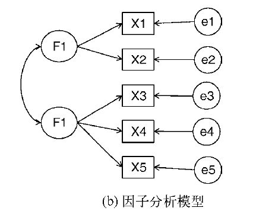
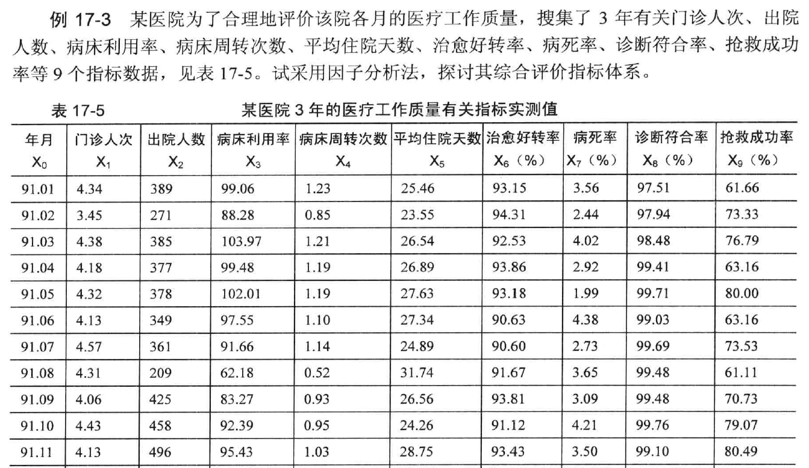

# **探索性因子分析**

## 因子分析


```{r,echo=FALSE}

```


探索性因子分析（EFA）是一系列用来发现一组变量潜在结构的方法。它通过寻找一组更小的、潜在的或隐藏的结构来解释已观测到的、显式的变量间的关系。

Harman74.cor包含了24个心理测验间的相互关系，受试对象为145个七年级或八年级的学生。应用EFA探索该数据表明276个测验间的相互关系可用四个学生能力的潜在因子（语言能力、反应速度、推理能力和记忆能力）进行解释。


## 因子分析模型形式

$$
X_i=a_1F_1+a_2F_2+\cdots +a_pF_p+U_i
$$


其中$X_i$是第i个可观测变量（$i=1…k$），$F_j$是公共因子（$j=1…p$），并且$p<k$。$U_i$是$X_i$变量独有的部分（无法被公共因子解释）。$a_i$可认为是每个因子对复合而成的可观测变量的贡献值。回到本章开头的Harman74.cor的例子，我们认为每个个体在24个心理学测验上的观测得分，是根据四个潜在心理学因素的加权能力值组合而成。

\


虽然PCA和EFA存在差异，但是它们的许多分析步骤都是相似的。为阐述EFA的分析过程，我们用它来对六个心理学测验间的相关性进行分析。

112个人参与了六个测验，包括非语言的普通智力测验（general）、画图测验（picture）、积木图案测验（blocks）、迷宫测验（maze）、阅读测验（reading）和词汇测验（vocab）。

我们如何用一组较少的、潜在的心理学因素来解释参与者的测验得分呢？数据集`ability.cov`提供了变量的协方差矩阵，你可用`cov2cor()`函数将其转化为相关系数矩阵。数据集没有缺失值。

## 因子分析的R语言实现

```{r}
## Exploratory factor analysis of ability.cov data
options(digits=2)
library(psych)
covariances <- ability.cov$cov
# convert covariances to correlations
correlations <- cov2cor(covariances)
correlations
```

因为要寻求用来解释数据的潜在结构，可使用EFA方法。与使用PCA相同，下一步工作为判断需要提取几个因子。

### 判断需提取的公共因子数

用`fa.parallel()`函数可判断需提取的因子数：

```{r,message=FALSE,warning=FALSE}
# determine number of factors to extract
fa.parallel(correlations, n.obs=112, fa="both", n.iter=100,
            main="Scree plots with parallel analysis")
abline(h=0,lwd=1,col="green")
```


***结果解读 1***

- 代码中使用了`fa="both"`,因子图形将会同时展示主成分和公共因子分析的结果。

- 图形中有几个值得注意的地方。如果使用PCA方法，你可能会选择一个成分(碎石检验和平行分析)或者两个成分(特征值大于1)当摇摆不定时，高估因子数通常比低估因子数的结果好，因为高估因子数般较少曲解“真实“情况。

- 观察EFA的结果，显然需提取两个因子。碎石检验的前两个特征值(△)都在拐角处之上，并且大于基于100次模拟数据矩阵的特征值均值。对于EFA, Kaiser-Harris准则的**特征值数大0, 而不是1**（大部分人都没有意识到这 ）图形中该准则也建议选择两个因子。


### 提取公共因子

现在你决定提取两个因子，可以使用`fa ()`函数获得相应的结果`fa()` 函数的格式如下：
`fa(r, nfactors=, n .obs= , rotate=, scores=, fm=)`

其中：

- `r`是相关系数矩阵或者原始数据矩阵；

- `nfactors` 设定提取的因子数(默认为1);

- `obs` 观测数（输入相关系数矩阵时需要填写）；

- `rotate`设定旋转的方法（默认互变异数最小法）；

- `scores` 设定是否计算因子得分（默认不计算）；

- `fm`设定因子化方法（默认极小残差法）

\

与PCA不同，提取公共因子的方法很多，包括最大似然法(ml)、主轴迭代法(pa)、加权最小二乘法(wls)、广义加权最小二乘法(gls)和最小残差法(minres)。统计学家青眯使用最大似然法，因为它有良好的统计性质，不过有时候最大似然法不会收敛，此时使用主轴迭代法效果会很好。

本例使用主轴迭代法` (fm="pa") `提取未旋转的因子

```{r}
fa <- fa(correlations, nfactors=2, rotate="none", fm="pa")
fa
```

***结果解读2***

- 可以看到，两个因子解释了六个心理学测验60%的方差。不过因子载荷阵的意义并不太好解释，此时使用因子旋转将有助于因子的解释。


### 因子旋转

你可以使用正交旋转或者斜交旋转来旋转两个因子的结果。现在我们同时尝试两种方法，看看它们的异同。

首先使用正交旋转：

```{r}
fa.varimax <- fa(correlations, nfactors=2, rotate="varimax", fm="pa")
fa.varimax
```

***结果解读3***

- 结果显示因子变得更好解释了。

- 阅读和词汇在第一因子上载荷较大，画图、积木图案和迷宫在第二因子上载荷较大，非语言的普通智力测量在两个因子上载荷较为平均，这表明存在一个语言智力因子、一个非语言智力因子。

\


使用正交旋转将人为地强制两个因子不相关。如果想允许两个因子相关该怎么办呢？此时可以使用斜交转轴法，比如`promax`

```{r}
#install.packages("GPArotation")
library(GPArotation)
fa.promax <- fa(correlations, nfactors=2, rotate="promax", fm="pa")
fa.promax
```

***结果解读 4 ***

- 根据以上结果，你可以看出正交旋转和斜交旋转的不同之处。 对于正交旋转，因子分析的重点在于*因子结构矩阵*（变量与因子的相关系数）。
而对于斜交旋转，因子分析会考虑3个矩阵：因子结构矩阵、因子模式矩阵和因子关联矩阵。

- *因子模式矩阵*即标准化的回归系数矩阵。它列出了因子预测变量的权重。*因子关联矩阵*即因子相关系数矩阵。


- 在结果中，`PA1`和`PA2`栏中的值组成了因子模式矩阵。
它们是标准化的回归系数，而不是相关系数。 
注意，矩阵的列仍用来对因子进行命名（虽然此处存在一些争论）。 你同样可以得到一个语言因子和一个非语言因子。

- 因子关联矩阵显示两个因子的相关系数为0.57,相关性很大。如果因子间的关联性很低，你可能需要重新使用正交旋转来简化问题。

\

因子结构矩阵（或称因子载荷阵没有被列出来，但你可以使用公式
`F=P*Phi` 很轻松地得到它，其中，F是因子载荷阵， P为因子模式矩阵， Phi为因子关联矩阵 下面的函数即可进行该乘
法运算

```{r}
fsm <- function(oblique) {
  if (class(oblique)[2]=="fa" & is.null(oblique$Phi)) {
    warning("Object doesn't look like oblique EFA")
  } else {
    P <- unclass(oblique$loading)
    F <- P %*% oblique$Phi
    colnames(F) <- c("PA1", "PA2")
    return(F)
  }
}
fsm(fa.promax)
```


现在你可以看到变量与因子间的相关系数。将它们与正交旋转所得因子载荷阵相比，你会发现该载荷阵列的噪音比较大，这是因为之前你允许潜在因子相关。 虽然斜交方法更为复杂，但模型将更符合真实数据

\

使用 `factor.plot()`或`fa.diagram()` 函数，你可以绘制正交或者斜交结果的图形

```{r}
factor.plot(fa.promax, labels=rownames(fa.promax$loadings))
```

数据集`ability.cov`中心理学测验的两因子图形:词汇和阅读在第一个因
子(PA1) 上载荷较大，而积木图案、画图和迷宫在第二个因子(PA2)上载
荷较大。普通智力测验在两个因子上较为平均。

```{r}
fa.diagram(fa.promax, simple=FALSE)
```

数据集`ability.cov` 中心理学测验的两因子斜交旋转结果图


\


## 因子分析应用案例


```{r,echo=FALSE}

```

```{r,warning=FALSE,message=FALSE}
library(psych)
example17_3  <- read.table ("data/example17_3.csv", header=TRUE, sep=",")
head(example17_3)
fa.parallel(example17_3, fa="fa", n.iter=100, main="Screen plots with parallel analysis")
abline(0,0)
```


***结果解读1***

- 由绘制的图形可知，0以上有4个节点，故我们可以提取4个因子


```{r}
fa <- fa(example17_3, nfactors=4, rotate="none", fm="ml", score=TRUE)
fa
```


***结果解读2***

- 我们可以看到，四个因子可以解释68%的方差，但是每个公共因子反应了哪些变量仍未可知，所以我们旋转一下因子。

```{r}
fa2 <- fa(example17_3, nfactors=4, rotate="varimax", fm="ml", score=TRUE)
fa2
fa2$weights
fa2$scores
factor.plot(fa2, labels=rownames(fa$loadings))
fa.diagram(fa2, simple=FALSE)
```


