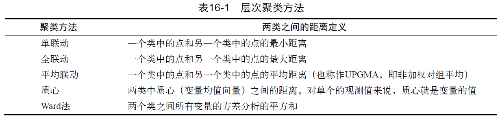

# **聚类分析**

## 概述

### 聚类的定义

聚类分析是一种数据降维技术，旨在揭露一个数据集中观测值的子集。它可以把大量的观测值归约为若干个类。这里的类被定义为若干个观测值组成的群组，群组内观测值的相似度比群间相似度高。这不是一个精确的定义，从而导致了各种聚类方法的出现。

### 两种聚类分析

最常用的两种聚类方法是层次聚类（hierarchical agglomerative clustering）和划分聚类（partitioning clustering）。在层次聚类中，每一个观测值自成一类，这些类每次两两合并，直到所有的类被聚成一类为止。在划分聚类中，首先指定类的个数K，然后观测值被随机分成K类，再重新形成聚合的类。

对于层次聚类来说，最常用的算法是单联动（single linkage）、全联动（complete linkage ）、平均联动（average linkage）、质心（centroid）和Ward方法。
对于划分聚类来说，最常用的算法是K均值（K-means）和围绕中心点的划分（PAM）。每个聚类方法都有它的优点和缺点，我们将在本章讨论。

### 聚类分析的一般步骤

1. 选择合适的变量

第一步是选择你感觉可能对识别和理解数据中不同观测值分组有重要影
响的变量。例如，在一项抑郁症研究中，你可能会评估以下一个或多个方面：心理学症状，身体症状，发病年龄，发病次数、持续时间和发作时间，住院次数，自理能力，社会和工作经历，当前的年龄，性别，种族，社会经济地位，婚姻状况，家族病史以及对以前治疗的反应。高级的聚类方法也不能弥补聚类变量选不好的问题。

\ 


2. 缩放数据

如果我们在分析中选择的变量变化范围很大，那么该变量对结果的影响也是最大的。这往往是不可取的，分析师往往在分析之前缩放数据。最常用的方法是将每个变量标准化为均值为0和标准差为1的变量。其他的替代方法包括每个变量被其最大值相除或该变量减去它的平均值并除以变量的平均绝对偏差。这三种方法能用下面的代码来解释:

```
df1 <- apply(mydata, 2, function(x){(x-mean(x))/sd(x)})
df2 <- apply(mydata, 2, function(x){x/max(x)})
df3 <- apply(mydata, 2, function(x){(x – mean(x))/mad(x)})
```

在本章中，你可以使用`scale()`函数来将变量标准化到均值为0和标准差为1的变量。这和第一个代码片段（`df1`）等价。

\ 


3. 寻找异常值

许多聚类方法对于异常值是十分敏感的，它能扭曲我们得到的聚类方案。你可以通过`outliers`包中的函数来筛选（和删除）异常单变量离群点。
`mvoutlier`包中包含了能识别多元变量的离群点的函数。一个替代的方法是使用对异常值稳健的聚类方法，围绕中心点的划分可以很好地解释这种方法。

\ 

4. 计算距离

尽管不同的聚类算法差异很大，但是它们通常需要计算被聚类的实体之间的距离。两个观测值之间最常用的距离量度是欧几里得距离，其他可选的量度包括曼哈顿距离、兰氏距离、非对称二元距离、最大距离和闵可夫斯基距离（可使用?dist查看详细信息）。在这一章中，计算距离时默认使用欧几里得距离。

\ 

5. 选择聚类算法

接下来选择对数据聚类的方法，层次聚类对于小样本来说很实用（如150个观测值或更少），而且这种情况下嵌套聚类更实用。划分的方法能处理更大的数据量，但是需要事先确定聚类的个数。一旦选定了层次方法或划分方法，就必须选择一个特定的聚类算法。这里再次强调每个算法都有优点和缺点

\ 

6.  获得一种或多种聚类方法。这一步可以使用步骤(5)选择的方法。

\ 

7. 确定类的数目

为了得到最终的聚类方案，你必须确定类的数目。对此研究者们也提出了很多相应的解决方法。常用方法是尝试不同的类数（比如2～K）并比较解的质量。在`NbClust`包中的`NbClust()`函数提供了30个不同的指标来帮助你进行选择（也表明这个问题有多么难解）。本章将多次使用这个包。


\ 


8. 获得最终聚类方案: 一旦类的个数确定下来，就可以提取出子群，形成最终的聚类方案。

\ 

9. 结果可视化:可视化可以帮助你判定聚类方案的意义和用处。层次聚类的结果通常表示为一个树状图。划分的结果通常利用可视化双变量聚类图来表示。

\ 

10. 解读类

一旦聚类方案确定，你必须解释（或许命名）这个类。一个类中的观测值有何相似之处？不同的类之间的观测值有何不同？这一步通常通过获得类中每个变量的汇总统计来完成。对于连续数据，每一类中变量的均值和中位数会被计算出来。对于混合数据（数据中包含分类变量），结果中将返回各类的众数或类别分布。

\ 

11. 验证结果

验证聚类方案相当于问：“这种划分并不是因为数据集或聚类方法的某种特性，而是确实给出了一个某种程度上有实际意义的结果吗？”如果采用不同的聚类方法或不同的样本，是否会产生相同的类？`fpc`、`clv`和`clValid`包包含了评估聚类解的稳定性的函数。


### 计算距离

聚类分析的第一步都是度量样本单元间的距离、相异性或相似性。两个观测值之间的欧几里得距离定义为：

$$
d_{ij}=\sqrt{\sum\limits_{p=1}^{p}(x_{ip}-x_{jp})^2}
$$

- 这里i和j代表第i和第j个观测值，p是变量的个数。

观测值之间的距离越大，异质性越大。观测值和它自己之间的距离是0。


```{r,message=FALSE,warning=FALSE}
par(ask=TRUE)
opar <- par(no.readonly=FALSE)
library(flexclust)

# Calculating Distances
data(nutrient, package="flexclust")
head(nutrient, 2)
d <- dist(nutrient)
as.matrix(d)[1:4,1:4]
```


### 层次聚类分析

在层次聚类中，起初每一个实例或观测值属于一类。聚类就是每一次把两类聚成新的一类，直到所有的类聚成单个类为止，算法如下：

➢ (1) 定义每个观测值（行或单元）为一类；

➢ (2) 计算每类和其他各类的距离；

➢ (3) 把距离最短的两类合并成一类，这样类的个数就减少一个；

➢ (4) 重复步骤(2)和步骤(3)，直到包含所有观测值的类合并成单个的类为止。

```{r,echo=FALSE}

```

营养数据的平均联动聚类

```{r}
data(nutrient, package="flexclust")
row.names(nutrient) <- tolower(row.names(nutrient))
nutrient.scaled <- scale(nutrient) #标准化数据集                                 
d <- dist(nutrient.scaled)                                          
fit.average <- hclust(d, method="average")                          
plot(fit.average, hang=-1, cex=.8, main="Average Linkage Clustering")
```

### 选择聚类的个数

```{r,warning=FALSE}
# Listing 16.2 - Selecting the number of clusters
library(NbClust)
nc <- NbClust(nutrient.scaled, distance="euclidean", 
              min.nc=2, max.nc=15, method="average")
par(opar)
table(nc$Best.n[1,])
barplot(table(nc$Best.n[1,]), 
        xlab="Numer of Clusters", ylab="Number of Criteria",
        main="Number of Clusters Chosen by 26 Criteria") 
```

### 获取最终的聚类方案

```{r}
# Listing 16.3 - Obtaining the final cluster solution
clusters <- cutree(fit.average, k=5) 
# cutree()函数用来把树状图分成五类
table(clusters)
aggregate(nutrient, by=list(cluster=clusters), median) 
# aggregate()函数用来获取每类的中位数
aggregate(as.data.frame(nutrient.scaled), by=list(cluster=clusters),
          median)
plot(fit.average, hang=-1, cex=.8,  
     main="Average Linkage Clustering\n5 Cluster Solution")
#树状图被重新绘制
rect.hclust(fit.average, k=5)
#rect.hclust()函数用来叠加五类的解决方案
```


## K均值算法

➢ 最常见的划分方法是K均值聚类分析。从概念上讲，K均值算法如下：

(1) 选择K个中心点（随机选择K行）；

(2) 把每个数据点分配到离它最近的中心点；

(3) 重新计算每类中的点到该类中心点距离的平均值（也就说，得到长度为p的均值向量，这里的p是变量的个数）；

(4) 分配每个数据到它最近的中心点；

(5) 重复步骤(3)和步骤(4)直到所有的观测值不再被分配或是达到最大的迭代次数（R把10次作为默认迭代次数）。


```{r,message=FALSE,warning=FALSE}
# Plot function for within groups sum of squares by number of clusters

wssplot <- function(data, nc=15, seed=1234){
  wss <- (nrow(data)-1)*sum(apply(data,2,var))
  for (i in 2:nc){
    set.seed(seed)
    wss[i] <- sum(kmeans(data, centers=i)$withinss)}
  plot(1:nc, wss, type="b", xlab="Number of Clusters",
       ylab="Within groups sum of squares")}

# Listing 16.4 - K-means clustering of wine data
library(rattle)
data(wine, package="rattle")
head(wine)
df <- scale(wine[-1])  # 标准化数据

wssplot(df)      
library(NbClust)
set.seed(1234) #设置种子数
nc <- NbClust(df, min.nc=2, max.nc=15, method="kmeans")
par(opar)
table(nc$Best.n[1,]) # 决定聚类个数

barplot(table(nc$Best.n[1,]), 
        xlab="Numer of Clusters", ylab="Number of Criteria",
        main="Number of Clusters Chosen by 26 Criteria") 
set.seed(1234)
fit.km <- kmeans(df, 3, nstart=25) # 进行K均值聚类分析
fit.km$size
fit.km$centers                                               
aggregate(wine[-1], by=list(cluster=fit.km$cluster), mean)

# evaluate clustering
ct.km <- table(wine$Type, fit.km$cluster)
ct.km   
library(flexclust)
randIndex(ct.km)


```


## 围绕中心点的划分

➢ 因为K均值聚类方法是基于均值的，所以它对异常值是敏感的。一个更稳健的方法是围绕中心点的划分（PAM）。与其用质心（变量均值向量）表示类，不如用一个最有代表性的观测值来表示（称为中心点）。K均值聚类一般使用欧几里得距离，而PAM可以使用任意的距离来计算。因此，PAM可以容纳混合数据类型，并且不仅限于连续变量

### PAM算法步骤

(1) 随机选择K个观测值（每个都称为中心点）；

(2) 计算观测值到各个中心的距离/相异性；

(3) 把每个观测值分配到最近的中心点；

(4) 计算每个中心点到每个观测值的距离的总和（总成本）；

(5) 选择一个该类中不是中心的点，并和中心点互换；

(6) 重新把每个点分配到距它最近的中心点；

(7) 再次计算总成本；

(8) 如果总成本比步骤(4)计算的总成本少，把新的点作为中心点；

(9) 重复步骤(5)～(8)直到中心点不再改变。


```{r,message=FALSE,warning=FALSE}
library(cluster)
set.seed(1234)
fit.pam <- pam(wine[-1], k=3, stand=TRUE)       
fit.pam$medoids                                 
clusplot(fit.pam, main="Bivariate Cluster Plot")


# evaluate clustering
ct.pam <- table(wine$Type, fit.pam$clustering)
ct.pam
library(flexclust)
randIndex(ct.pam)

## Avoiding non-existent clusters
library(fMultivar)
set.seed(1234)
df <- rnorm2d(1000, rho=.5)
df <- as.data.frame(df)
plot(df, main="Bivariate Normal Distribution with rho=0.5")

wssplot(df)
library(NbClust)
nc <- NbClust(df, min.nc=2, max.nc=15, method="kmeans")
par(opar)
barplot(table(nc$Best.n[1,]), 
        xlab="Numer of Clusters", ylab="Number of Criteria",
        main  ="Number of Clusters Chosen by 26 Criteria")
library(ggplot2)
library(cluster)
fit <- pam(df, k=2)
df$clustering <- factor(fit$clustering)
ggplot(data=df, aes(x=V1, y=V2, color=clustering, shape=clustering)) +
  geom_point() + ggtitle("Clustering of Bivariate Normal Data")

plot(nc$All.index[,4], type="o", ylab="CCC",
     xlab="Number of clusters", col="blue")

```


